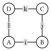
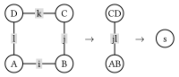
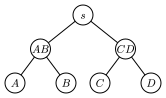
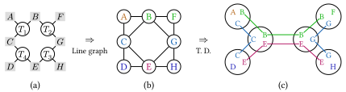
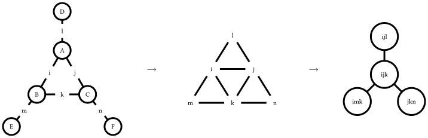
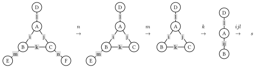
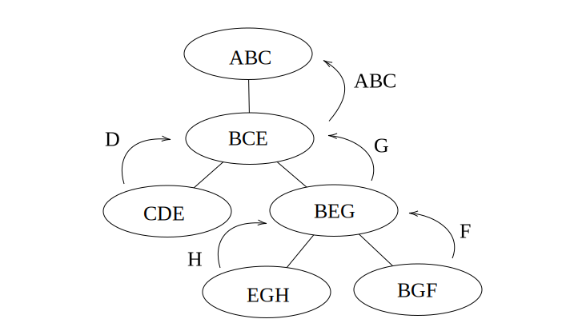

# Tensor Network Contraction Order Optimization with Optimal Tree Decomposition

This blog is a technical note for the [Google Summer of Code 2024](https://summerofcode.withgoogle.com) project ["Tensor network contraction order optimization and visualization"](https://summerofcode.withgoogle.com/programs/2024/projects/B8qSy9dO) released by **The Julia Language**, where I developed a package [TreeWidthSolver.jl](https://github.com/ArrogantGao/TreeWidthSolver.jl) for calculating the tree decomposition with minimal treewidth of a given simple graph and made it a backend of [OMEinsumContracionOrders.jl](https://github.com/TensorBFS/OMEinsumContractionOrders.jl).

This blog covers the following contents:
1. Contraction order of tensor network
2. Tree decomposition and its relation to contraction order
3. Finding tree decomposition with minimal treewidth

In this blog, we will use the Einsum notation from [OMEinsum.jl](https://github.com/under-Peter/OMEinsum.jl).

## Tensor Network Contraction Order

In this blog, we will not introduce the basic concept of tensor network, since it has been well introduced in many other places.
Instead, we recommend the following references:
* For readers with physics background: [https://tensornetwork.org/diagrams/](https://tensornetwork.org/diagrams/)
* For readers want to get a formal definition: Chapter 2 of [https://epubs.siam.org/doi/abs/10.1137/22M1501787](https://epubs.siam.org/doi/abs/10.1137/22M1501787)

For simplicity, in the following sections, we will use the Einstein summation formula to represent the tensor network as high dimensional arrays' multiplication:
$$R_{i,j,k,...} = \sum_{a, b, c, ...} A_{a,...}B_{b,...}...$$
It is easy to see that the most direct way to calculate the result is to loop over all the indices naively, which requires $O(d^N)$ operations, where $d$ is the dimension of the index and $N$ is the number of indices.
However, such a direct calculation is not efficient.
Considering the following simple tensor network:



where the tensors are represented by the circles and the indices are represented by the lines, representing the following contraction to scalar $s$:
$$s = \sum_{i,j,k,l} A_{ij} B_{ik} C_{jl} D_{lk},$$
and can be represented as the following Einstein summation formula:
```julia
julia> using OMEinsum

julia> einsum = ein"ij, ik, jl, lk -> "
ij, ik, jl, lk ->
```
where pointing to nothing means the result is a scalar.
Here we simply assume that all indices are of the same dimension $D$.
Then the naive way to calculate the result is to loop over all the indices, which requires $O(D^4)$ operations and no intermediate tensors are produced.

However, another way to calculate $s$ is shown below:



where we first contract $A$ and $B$ to get $AB$, and contract $C$ and $D$ to get $CD$, which are rank-2 intermediate tensors, and then contract $AB$ with $CD$ to get the scalar $s$.
That is equivalent to the following Einstein summation formula:
```julia
julia> nested_ein = ein"(ij, ik), (jl, lk) -> "
jk, jk ->
├─ ij, ik -> jk
│  ├─ ij
│  └─ ik
└─ jl, lk -> jk
   ├─ jl
   └─ lk
```
In this way, the total number of operations is $O(2 D^{3} + D^{2})$, which is smaller than the naive calculation, while the trade-off is that we need to store the intermediate tensors $AB$ and $CD$ with size of $O(D^{2})$, as shown below:
```julia
# here we take D = 16
julia> size_dict = uniformsize(einsum, 2^4)

julia> contraction_complexity(einsum, size_dict)
Time complexity: 2^16.0
Space complexity: 2^0.0
Read-write complexity: 2^10.001408194392809

julia> contraction_complexity(nested_ein, size_dict)
Time complexity: 2^13.044394119358454
Space complexity: 2^8.0
Read-write complexity: 2^11.000704269011246
```
We say such a contraction is with **time complexity** of $O(D^{3})$ and **space complexity** of $O(D^{4})$, which are defined as follows:
* **time complexity**: the number of Floating Point operations required to calculate the result;
* **space complexity**: the largest size of the intermediate tensors.
For larger tensor networks, the contraction order is important, since it can greatly reduce the time complexity of the calculation.

In actual calculation, we prefer binary contractions, i.e., contracting two tensors at a time, by converting these two tensors as matrices, so that we can make use of BLAS libraries to speed up the calculation.
In this way, a given contraction order can be represented as a binary tree.
The contraction tree can be represented as a rooted tree, where the leaves are the tensors to be contracted and the internal nodes are the intermediate tensors.
The contraction tree corresponding to the above example is shown below:



Generally speaking, our target is to find a binary contraction order, with minimal time complexity or space complexity, which is called the **optimal contraction order**.


### Tools for Tensor Network Contraction Order Optimization

In practice, there are many tools for tensor network contraction order optimization, including:
* [OMEinsumContractionOrder.jl](https://github.com/TensorBFS/OMEinsumContractionOrders.jl): an open-source Julia package for finding the optimal contraction order of tensor networks, is used as backend of [OMEinsum.jl](https://github.com/under-Peter/OMEinsum.jl) and [ITensorNetworks.jl](https://github.com/mtfishman/ITensorNetworks.jl).
* [Cotengra](https://cotengra.readthedocs.io/en/latest/) : a python library for contracting tensor networks or einsum expressions involving large numbers of tensors.

Various methods have been proposed for optimizing the contraction order, as shown in the table below, here we introduce some of them.

| Optimizer      | Description | Available in |
| ----------- | ----------- | ----------- |
| Exhaustive Search | Slow, exact | TensorOperations.jl |
| Greedy Algorithm | Fast, heuristic | OMEinsumContractionOrders.jl, Cotengra |
| Binary Partition | Fast, heuristic | OMEinsumContractionOrders.jl, Cotengra |
| Local Search | Fast, heuristic | OMEinsumContractionOrders.jl |
| Exact Treewidth | Slow, exact | OMEinsumContractionOrders.jl |

#### Exhaustive Search

The exhaustive search [Robert](https://doi.org/10.1103/PhysRevE.90.033315) is a method to get the exact optimal contraction complexity.
There are three different ways to implement the exhaustive search:
* **Depth-first constructive approach**: in each step, choose a pair of tensors to contract a new tensor until all tensors are contracted, and then iterate over all possible contraction sequences without duplication. Note the cheapest contraction sequence thus found.
* **Breadth-first constructive approach**: the breadth-first method construct the set of intermediate tensors by contracting $c$ tensors ($c \in [1, n - 1]$, where $n$ is the number of tensors) in each step, and record the optimal cost for constructing each intermediate tensor. Then in the last step, the optimal cost for contracting all $n$ tensors is obtained.
* **Dynamic programming**: in each step, consider all bipartition that split the tensor network into two parts, if the optimal cost for each part is not recorded, further split them until the cost has been already obtained or only one tensor is left. Then combine the two parts and record the optimal cost of contracting the sub-networks. In this end the optimal cost for the whole network is obtained.
In more recent work [Robert](https://doi.org/10.1103/PhysRevE.90.033315), by reordering the search process in favor of cheapest-first and excluding large numbers of outer product contractions which are shown to be unnecessary, the efficiency of the exhaustive search has been greatly improved.
The method has been implemented in [TensorOperations.jl](https://github.com/Jutho/TensorOperations.jl).

#### Greedy Algorithm

The Greedy method is one of the simplest and fastest method for optimizing the contraction order. The idea is to greedily select the pair of tensors with the smallest cost to contract at each step. In each step, for all possible pairs of tensors, the cost of the contraction is evaluated, and the pair with the smallest cost is selected and then contracted, which forms a new tensor.  This process is repeated until all tensors are contracted. This method is fast, however it is easy to be trapped in local minima.

An enhanced method is called the hyper-greedy method, where in each step one does not directly select the pair with the smallest cost, but instead samples according to the Boltzmann distribution given by $\mathcal{P}(v_i, v_j) = e^{-{L(v_i, v_j)} / {T}}$, where $L(v_i, v_j)$ is the cost function. In this case, it is possible for the process to escape from local minima. Then we run this process multiple times and select the best result.
The method has already been used in both OMEinsumContractionOrders.jl and Cotengra. 

#### Binary Partition

A given tensor network can be regarded as a hypergraph, where the tensors are the vertices and the shared indices are the hyperedges, and the cost of contracting a hyper edge can be encoded as its weight. The binary partition method is to partition the hypergraph into two parts, and then recursively partition each part. Cost of each partition can be evaluated by the sum of the weights of the hyperedges cut by the partition, while we prefer to make the partition as balanced as possible (balance means size of the subgraph should be similar). Thus, the problem is reduced to a balanced min cut problem on a hypergraph. In the past few decades, the graph community has developed many algorithms for the balanced min cut problem and provided the corresponding software packages, such as [KaHyPar](https://kahypar.org) [kahypar](https://doi.org/10.1145/3529090), which has already been used in both OMEinsumContractionOrders.jl and Cotengra. 

#### Local Search Method

The local search method [Kalachev](https://doi.org/10.48550/arXiv.2108.05665) (also called the tree simulated annealing) is another type of the optimization method based on local search and simulating annealing. TreeSA is based on the following rules:

* Associativity: $T \times (S \times R) = (T \times S) \times R$,
* Commutativity: $T \times S = S \times T$.

These rules lead to the four possible transforms of the contraction tree as shown in the following figure.


The TreeSA method starts from a random contraction tree and then applies the above rules to transform the tree. The cost of the contraction tree is evaluated and the tree is updated according to the Metropolis criterion. During the process, the temperature is gradually decreased, and the process stop when the temperature is low enough.
The method has already been used in OMEinsumContractionOrders.jl.


The method listed above are powerful and efficient, which can be used to find great contraction orders of various tensor networks.
However, the methods above except exhaustive search are heuristic methods and may not guarantee to find the optimal contraction order, while the exhaustive search can be too slow for large tensor networks.
In the following sections, we will introduce a method to find the optimal contraction order based on the optimal tree decomposition.

## Finding the Optimal Contraction Order via Tree Decomposition

In the previous section, we introduce the concept of tensor network and its contraction order, so that now you should understand why the contraction order so important. 
Then the next question is how to find the optimal contraction order.

In our work, we propose to use the tree decomposition of the line graph of the hypergraph representation of the tensor network to find the optimal contraction order, according to the following well known theorem[Markov](https://doi.org/10.1137/050644756) :

**Theorem 1**. Let $C$ be a quantum circuit with $T$ gates and whose underlying circuit graph is $G_c$. Then $C$ can be simulated deterministically in time $T^{O(1)} e^{O(tw(G_C))}$, where $tw(G_C)$ is the treewidth of $G_C$.

Using the language of tensor network, we can rewrite the above theorem as follows: the bottleneck of time complexity of the contraction of a tensor network is $O(e^{O(tw(L(G)))})$, where $L(G)$ is the line graph of the hypergraph representation of the tensor network. 
Therefore, if we can find the tree decomposition of the tensor network with minimal treewidth, we can find the optimal contraction order of the tensor network.
We developed a package [TreeWidthSolver.jl](https://github.com/ArrogantGao/TreeWidthSolver.jl) for finding the optimal tree decomposition of a given simple graph, which can be used as a backend of [OMEinsumContractionOrders.jl](https://github.com/TensorBFS/OMEinsumContractionOrders.jl).
For more details about the tree decomposition and its relation to the contraction order, please refer to the appendix.

Here is an example of usage:
```julia
julia> using OMEinsum, OMEinsumContractionOrders

# define the contraction using Einstein summation
julia> code = ein"ijl, ikm, jkn, l, m, n -> "
ijl, ikm, jkn, l, m, n -> 

ulia> optimizer = ExactTreewidth()
ExactTreewidth{GreedyMethod{Float64, Float64}}(GreedyMethod{Float64, Float64}(0.0, 0.0, 1))

# set the size of the indices
julia> size_dict = uniformsize(code, 2)
Dict{Char, Int64} with 6 entries:
  'n' => 2
  'j' => 2
  'i' => 2
  'l' => 2
  'k' => 2
  'm' => 2

julia> optcode = optimize_code(code, size_dict, optimizer)
n, n -> 
├─ jk, jkn -> n
│  ├─ ij, ik -> jk
│  │  ├─ ijl, l -> ij
│  │  │  ├─ ijl
│  │  │  └─ l
│  │  └─ ikm, m -> ik
│  │     ├─ ikm
│  │     └─ m
│  └─ jkn
└─ n

# check the complexity
julia> contraction_complexity(optcode, size_dict)
Time complexity: 2^5.087462841250339
Space complexity: 2^2.0
Read-write complexity: 2^5.882643049361841

# check the results
julia> A = rand(2, 2, 2); B = rand(2, 2, 2); C = rand(2, 2, 2); D = rand(2); E = rand(2); F = rand(2);

julia> code(A, B, C, D, E, F) ≈ optcode(A, B, C, D, E, F)
true
```

This optimizer will be used as an extension of [TensorOperations.jl](https://github.com/Jutho/TensorOperations.jl) in the future, see this [PR](https://github.com/Jutho/TensorOperations.jl/pull/185).
We compared the performance of this method against the default optimizer of TensorOperations.jl based on exhaustive searching, the results is shown below.


The results shown that the tree width based solver is faster for some graph similar to trees.
For more details, please see the benchmark repo: [https://github.com/ArrogantGao/TreeWidthSolver_benchmark](https://github.com/ArrogantGao/TreeWidthSolver_benchmark).

## Appendix: Details about Tree Decomposition and its Relation to Contraction Order

### Line Graph

A formal definition of the [**line graph**](https://en.wikipedia.org/wiki/Line_graph) is as follows:

**Definition 1**. Given a graph G, its line graph $L(G)$ is a graph such that: 
   1. each vertex of $L(G)$ represents an edge of $G$; 
   2. two vertices of $L(G)$ are adjacent if and only if their corresponding edges share a common endpoint ("are incident") in $G$. 

That is, it is the intersection graph of the edges of G, representing each edge by the set of its two endpoints.

For a tensor network, we can construct a hypergraph $G$ whose vertices are the tensors and whose hyperedges are the indices. 
Then the line graph $L(G)$ of the hypergraph $G$ is the graph whose vertices are the indices and whose edges are the tensors, which is a simple graph, as shown in the following figure:



Since we are considering a tensor network, dimension of the indices have to be considered. 
Therefore, for each vertex of the line graph $L(G)$, we define its weight as $\log_2(d)$, where $d$ is the dimension of the index.
In this way, size of a tensor can be represented as the sum of weights of the vertices in $L(G)$.

### Tree Decomposition and Tree Width

Intuitively, a [**tree decomposition**](https://en.wikipedia.org/wiki/Tree_decomposition) represents the vertices of a given graph $G$ as subtrees of a tree, in such a way that vertices in $G$ are adjacent only when the corresponding subtrees intersect.

The tree decomposition of a graph is a tree whose nodes are subsets of the vertices of the graph, and the following conditions are satisfied:

1. Each vertex of the graph is in at least one node of the tree.
2. For each edge of the graph, there is a node of the tree containing both vertices of the edge.
3. Bags containing the same vertex have to be connected in the tree.

All the nodes of the tree are called **tree bags**, and intersection of two bags is called a **separator**.
The width of a tree decomposition is the size of the largest bag minus one.
Clearly, one graph can have multiple tree decomposition with different corresponding widths. The tree width of a graph is the minimal width of all such decompositions, and a particular decomposition (not necessarily unique) that realises this minimal width is called an optimal tree decomposition.

An example of the optimal tree decomposition is shown in the following figure:



where the left graph is the original graph and the right one is the tree decomposition of the graph, and the tree width is 2.


To find the optimal tree decomposition of a simple graph, one can use the Bouchitté-Todinca algorithm [Bouchitté](https://doi.org/10.1137/S0097539799359683) algorithm, one can refer to it for more details.

### From Tree Decomposition to Contraction Order

Then how tree decomposition and tree width are related to the contraction order of the tensor network?
In this sub-section, we will answer the following questions: how to get a contraction order from a tree decomposition? And why the contraction order is optimal if the tree width is minimal?

For the first question, according to the definition of tree decomposition, we can obtain vertices elimination order by traversing the tree decomposition in a bottom-up manner. 
For each node of the tree decomposition, a vertex can be eliminated if it is in the bag of the node and not in the bags of its parent node. 
The order is $\{\{i, j, l\}, \{k\}, \{m\}, \{n\}\}$, where the last vertex is to be eliminated first.

The elimination order of the indices can then be used to determine the contraction order of the tensor network, where two tensors are contracted if they share a common index and the index is eliminated.
According to the elimination order above, the contraction is shown below:



Of course, the contraction order is not unique as, by selecting different node as the root of the decomposition tree, different contraction orders can be obtained.

Then to answer the second question, we have to introduce a property of the optimal tree decomposition:

**Proposition 1**: all tree bags of the optimal tree decomposition are cliquish, i.e., the vertices in the same bag are either connected or belong to the same separator.

If two indices are connected in the line graph, then they at least belong to a same tensor.
For the separators, notice that in a contraction order from a tree decomposition, a separator is exactly the indices of an intermediate tensor, so that they should also be treated as connected.
In the example above, $BE$ has indices $ik$, corresponding to the separator $\{i, k\}$ between tree bags $\{i, j, k\}$ and $\{i, k, m\}$, and so on.

Therefore, in a tree bag all indices are "connected", in each step of the contraction, we will have to loop over all the indices in the same bag, so that the bottleneck of time complexity is exactly by $O(e^{tw(G) + 1})$, and the since all intermediate tensors are characterized by the separators, and separators are real subset of tree bags, the space complexity bounded by $O(e^{tw(G)})$.

**Remark**: It should be remarked in the general cases, sizes of the separators (the intersection of the bags) may not be size of the bags minus one.

Thus, we can conclude that the contraction order obtained from the optimal tree decomposition is the optimal contraction order of the tensor network.


# Finding the Optimal Tree Decomposition with Minimal Treewidth

This blog detailed introduce the algorithm to find the optimal tree decomposition with minimal treewidth of a given simple graph, and how it is implemented in Julia package [TreeWidthSolver.jl](https://github.com/ArrogantGao/TreeWidthSolver.jl).

The following is the outline of this blog:
* Tree width and tree decomposition
* The Bouchitté–Todinca algorithm for exact tree width
* A Julia implementation: TreeWidthSolver.jl

## Tree Width and Tree Decomposition

In this section, I will introduce the basic concepts of tree width and tree decomposition.

Intuitively, a [**tree decomposition**](https://en.wikipedia.org/wiki/Tree_decomposition) represents the vertices of a given graph $G$ as subtrees of a tree, in such a way that vertices in $G$ are adjacent only when the corresponding subtrees intersect.

**Defination 1** (tree decomposition): The tree decomposition of a graph is a tree whose nodes are subsets of the vertices of the graph, and the following conditions are satisfied:

1. Each vertex of the graph is in at least one node of the tree.
2. For each edge of the graph, there is a node of the tree containing both vertices of the edge.
3. Bags containing the same vertex have to be connected in the tree.

An example of tree decomposition is shown in the following figure:


 
where the (b) is the original graph and the (c) is the tree decomposition of the graph.

The nodes of the tree are called **tree bags**.
The width of a tree decomposition is the size of the largest bag minus one, thus the width of the example above is $2$.
Clearly, one graph can have multiple tree decompositions, and the **tree width** of a graph is the minimum width of all possible tree decompositions.

Tree decompositions play an important role in graph theory and combinatorial optimization, many NP-hard problems such as maximum independent set, minimum dominating set, chromatic number, and Hamiltonicity can be solved with dynamic programming over a tree decomposition, with a running time exponential in the width of the decomposition but linear in the size of the graph
For our purpose, tree decompositions can be used to optimize the contraction order of tensor networks, which is a key step in many quantum many-body simulations.
However, find the optimal tree decomposition with minimal treewidth is also an NP-hard problem.
In the following sections, I will introduce an exact algorithm to calculate the treewidth of a graph.

Another important concept is the **vertex elimination order**, which can be obtained from the tree decomposition.
An example is shown below, where the tree decomposition of the graph above is formulated as a tree by selecting one of the tree bag as root.
Then a vertex is eliminated if it exists in child bags but not in the parent bag, and the elimination order is the order of the vertices being eliminated, and child of the same parent can be eliminated in arbitrary order.
In this example, the elimination order is $\{\{A, B, C\}, \{D\}, \{G\}, \{F\}, \{H\}\}$, where the last is the first to be eliminated.



## The Bouchitté–Todinca Algorithm for Exact Tree Width

Various algorithms have been developed to calculate the treewidth of a graph in the past few decades, both exactly and approximately.
In this section, I will introduce one of the most basic exact algorithms: the Bouchitté–Todinca (BT) algorithm [Bouchitte](https://doi.org/10.1137/S0097539799359683) [BouchitteListing](https://doi.org/10.1016/S0304-3975(01)00007-X) [Tuukka](https://tuukkakorhonen.com/papers/msc-thesis.pdf), which makes use of the theory of minimal triangulations, characterizing the minimal triangulations of a graph via objects called minimal separators and potential maximal cliques of the graph.

### Triangulation and Minimal Triangulation

First of all, let's introduce the concept of triangulation and minimal triangulation.

Triangulations of graphs are a central graph-theoretic concept in the computation of tree decompositions. 
Triangulations are defined via *chordality* of graphs. 
A graph G is chordal if every cycle in $G$ with at least $4$ vertices contains a chord, which is an edge that is not part of the cycle but connects two vertices of the cycle
Correspondingly, a non-chordal graph has at least one chordless cycle, i.e., a cycle with at least $4$ vertices that does not have a chord.

**Definition 2** (triangulation). A graph $H$ is a triangulation of a graph $G$ if $H$ is chordal, $V (G) = V (H)$, and $E(G) \subseteq E(H)$.

Here is an example of a triangulation of a graph:


where the left graph is the original graph and the right one is a triangulation of the graph.


### Minimal Separator and Potential Maximal Cliques

Then we can introduce the concept of minimal separator and potential maximal cliques.

A set of vertices $S \subseteq V (G)$ is an $a,b$-separator of a graph $G$ if the vertices $a$ and $b$ are in different connected components of $G \setminus S$. 
In other words, all paths between $a$ and $b$ go through $S$. The set $S$ is a minimal $a,b$-separator of $G$ if no subset of $S$ is also an $a,b$-separator.
The minimal separator of a graph is defined as follows:

**Defination 3** (minimal separator): Let $G$ be a graph. A set of vertices $S \subseteq V (G)$ is a minimal separator of $G$ if it is a minimal $a,b$-separator for some pair $a, b \in V (G)$.

For example, in the graph shown above, the set $\{B, C\}$ is a minimal separator of the graph, which separates the graph into two disconnected parts: $\{A\}$ and $\{D, E, F, G, H\}$.
It is also easy to see that the set $\{B,C\}$ is exactly the intersection of the two neighboring bags $\{A, B, C\}$ and $\{B, C, E\}$ in the tree decomposition.
Actually, all intersection of neighboring bags in a tree decomposition is a separator of the graph.


**Defination 4** (potential maximal clique): A set of vertices $\Omega \subseteq V (G)$ is a potential maximal clique of a graph $G$ if there is a minimal triangulation $H$ of $G$ such that $\Omega$ is a maximal clique of $H$. A set of vertices is a maximal clique if it is a clique and no strict superset of it is a clique.

For example, in the graph shown above, the sets $\{B,C,E\}$, $\{B,G,E\}$, $\{B,C,G\}$ and $\{C, E, G\}$ are all potential maximal cliques of the graph, corresponding to different triangulations of the graph:


### The Bouchitté–Todinca Dynamic Programming Algorithm

The reason that we are interested in minimal separators and potential maximal cliques the following properties of the optimal tree decomposition:
* All tree bags of a tree decomposition with minimal treewidth are potential maximal cliques of the graph.
* The intersection of any two neighboring bags in a tree decomposition is a minimal separator of the graph.
Based on these properties, the Bouchitté–Todinca algorithm first calculates all minimal separators and potential maximal cliques of the graph, and then uses dynamic programming to find a set of potential maximal cliques that minimizes the width of the tree decomposition.

In this section, I will introduce the Bouchitté–Todinca algorithm in detail, which can be separated into the following steps:
* List all minimal separators, $\Delta$;
* List all potential maximal cliques, $\Pi$;
* Calculate the treewidth of the graph.

#### Step 1: List all minimal separators

To recognize minimal separators of a graph, we mainly use the following property.

For a set of vertices $S$, consider the connected components of $G \setminus S$, represented as $\mathcal{C}(G \setminus S)$, which are called the components of $S$.
For $C \in \mathcal{C}(G \setminus S)$, if $N(C) = S$, then $C$ is called a full-component of $S$.

**Theorem 1** (minimal separator): The set $S$ is a minimal separator if and only if it has two or more than two full-components.

For example, $\{B, C\}$ is a minimal separator of the graph shown above, with two full-components $\{A\}$ and $\{D, E, F, G, H\}$.
While $\{B, C, F\}$ is not, since it has only one full-component $\{D, E, G, H\}$.

It is shown that the following proposition holds:

**Proposition 1**: Let $S$ be a minimal separator of a graph $G$ and $a$ a vertex of $G$, then neighbors of the connected components of $G \setminus (S \cup \{a\})$, i.e.
$$ \mathcal{R}(S) = \{N(C) | C \in \mathcal{C}(G \setminus (S \cup \{a\}))\} $$
are all minimal separators of the graph.

Then we start from all vertices $v$ of the graph and theirs neighbor $N(v)$, and repeatedly apply the proposition above to list all minimal separators of the graph.

#### Step 2: List all potential maximal cliques

In the second step we list all potential maximal cliques of the graph using $\Delta$ calculated in the first step.
To check a set of vertices $\Omega$ is a potential maximal clique, we can use the following property:

**Theorem 2** (potential maximal clique): Let $\Omega$ be a set of vertices of a graph $G$. The set $\Omega$ is a potential maximal clique if and only if the following conditions hold:
* for any pair of vertices $a, b \in \Omega$, either $a$ and $b$ are connected by an edge in the graph, or there is a minimal separator $S$ such that $a \in S$ and $b \in S$;
* no component of $\Omega$ is full;
where the first one is called the *cliquish condition*, and the second one is called the *non-full condition*.

Then, one can use the following rules to list all potential maximal cliques: 

**Proposition 2**: Let $\Omega$ be a potential maximal clique and $a$ a vertex of $G$, and $a$ is a vertex of $G$.
If $V(G) \geq 2$, one of the following conditions holds:
1. $\Omega \setminus \{a\} \in \Pi(G \setminus \{a\})$;
2. $\Omega \setminus \{a\} \in \Delta(G)$;
3. $\Omega = S \cup T \setminus \{a\}$, where $S$ and $T$ are minimal separators of $G$ such that $a \notin S$, $S \notin \Delta(G \setminus \{a\})$ and $a \in T$.

The proposition indicates that with $\Pi(G \setminus \{a\})$, $\Delta(G \setminus \{a\})$ and $\Delta(G)$, one can construct $\Pi(G)$ by adding one vertex $a$ to the graph.

Then one can iteratively construct the graph by adding one vertex each time, here we represent the $i$-th graph as $G_i = G(\{v_1, v_2, \cdots, v_i\})$, and then calculate $\Pi(G_i)$ using $\Pi(G_{i-1})$, $\Delta(G_{i-1})$ and $\Delta(G_i)$ according to the proposition above, until $i = N$ and all potential maximal cliques are found.

#### Step 3: Calculate the treewidth of the graph

Finally, we can calculate the treewidth of the graph using $\Delta$ and $\Pi$ calculated in the first two steps.

The BT algorithm is based on the following two ideas: 
1. all tree bags of the tree decomposition with minimal treewidth are potential maximal cliques of the graph;
2. tree width of a graph is larger than that of its subgraphs.

Then for a given potential maximal clique $\Omega$, the minimal treewidth among all tree decompositions with $\Omega$ is given by
$$tw(\Omega) = \max(|\Omega| - 1, tw(G(C_i \cup S_i))),~C_i \in \mathcal{C}(G \setminus \Omega),~S_i = C_i \cap \Omega,$$
and the treewidth of the graph is the minimum of $tw(\Omega)$ among all potential maximal cliques $\Omega$.

For example, in the figure below, we assume that the potential maximal clique $\Omega = \{B, C, E\}$ with width $2$ is in the decomposition, and then we need to compare that against the width of the subgraphs $G(\{A, B, C\})$, $G(\{C, D, E\})$ and $G(\{B, E, F, G, H\})$.
Since $\{A, B, C\}$ and $\{C, D, E\}$ are already potential maximal cliques, theirs width is $2$; and for $G(\{B, E, F, G, H\})$, we can apply a similar procedure to calculate the width of the subgraphs, which is also $2$.
Thus $tw(\{B, C, E\}) = 2$.
By comparing width of all possible choices of $\Omega$, we can find the treewidth of the graph.

The BT algorithm first calculates all possible $G(C \cup S)$ for all $\Omega$ and sort the triplets $(\Omega, C, S)$ according to size of $C \cup S$.
Then with the help of dynamic programming, the algorithm calculate width of subgraph $G(C \cup S)$ from the smallest to the largest.
In each step, treewidth of all possible subgraphs of the current graph $G(C \cup S)$ is already calculated, so that the treewidth of $G(C \cup S)$ can be directly obtain by comparing the width of the subgraphs and $|\Omega| - 1$.

Furthermore, if the choice of $\Omega$ of each step is stored, the tree decomposition can be easily obtained by connecting these potential maximal cliques.

Using the BT algorithm, one can calculate the treewidth of a graph exactly, and the algorithm has a time complexity of $O(|\Pi|nm)$, which are dependent on the graph structure.

## A Julia Implementation: TreeWidthSolver.jl

In this section, I will introduce how the algorithm is implemented in the package [TreeWidthSolver.jl](https://github.com/ArrogantGao/TreeWidthSolver.jl), which is a simple and efficient implementation of the Bouchitté–Todinca algorithm for exact tree width calculation.
The package in developed using the Julia Programming Language, which is a high performance programming language develop in the past decade.
For readers who are not familiar with Julia, I recommend this article: [Effective Extensible Programming: Unleashing Julia on GPUs](https://arxiv.org/pdf/1712.03112.pdf), which gives a brief introduction to the language and its features.

### Highly Efficient Set Operations with BitBasis.jl

In the BT algorithm, the main operations are finding connected components of induced subgraphs, and finding neighbors of a set of vertices.
However, in the Julia package `Graphs.jl`, the vertices are stored as integers, as shown below:
```julia
julia> using Graphs

julia> g = smallgraph(:petersen)
{10, 15} undirected simple Int64 graph

julia> g.fadjlist
10-element Vector{Vector{Int64}}:
 [2, 5, 6]
 [1, 3, 7]
 [2, 4, 8]
 [3, 5, 9]
 [1, 4, 10]
 [1, 8, 9]
 [2, 9, 10]
 [3, 6, 10]
 [4, 6, 7]
 [5, 7, 8]
```
If we use a similar data structure and use `Vector` or `Set` of integers to represent the vertices set, these operations are easy to implement but will be very slow, due to the slow set operations and huge memory usage.

To reach a highly efficient implementation, we use the bit array to represent the sets of vertices, based on the `LongLongUInt` type provided in the package [BitBasis.jl](https://github.com/QuantumBFS/BitBasis.jl), which provides types and operations for basis represented by bits in linear algebra.

For example, here we show how to use generate a bit array to represent the set of vertices $\{1, 2, ..., 10\}$ of a graph:
```julia
julia> using BitBasis

julia> a = bmask(LongLongUInt{1}, 1:10)
LongLongUInt{1}((0x00000000000003ff,))

julia> typeof(a)
LongLongUInt{1}

julia> isbitstype(typeof(a))
true

# vizualize the bit array, not necessary
julia> BitStr{64}(a)
0000000000000000000000000000000000000000000000000000001111111111 ₍₂₎
```
and of course the set operations are also supported:
```julia
julia> a = bmask(LongLongUInt{1}, 1:10)
LongLongUInt{1}((0x00000000000003ff,))

julia> b = bmask(LongLongUInt{1}, 8:12)
LongLongUInt{1}((0x0000000000000f80,))

# for simplicity, we only show the first 15 bits
julia> BitStr{15}(a)
000001111111111 ₍₂₎

julia> BitStr{15}(b)
000111110000000 ₍₂₎

# a ∪ b
julia> BitStr{15}(a | b)
000111111111111 ₍₂₎

# a ∩ b
julia> BitStr{15}(a & b)
000001110000000 ₍₂₎
```
Since they are all bitwise operations, the operations are very fast and memory efficient.
```julia
julia> set_a = Set([1:10...]);

julia> set_b = Set([8:12...]);

julia> @benchmark $set_a ∩ $set_b
BenchmarkTools.Trial: 10000 samples with 952 evaluations.
 Range (min … max):   93.269 ns …  52.749 μs  ┊ GC (min … max):  0.00% … 99.77%
 Time  (median):      95.982 ns               ┊ GC (median):     0.00%
 Time  (mean ± σ):   111.883 ns ± 533.091 ns  ┊ GC (mean ± σ):  10.14% ±  7.71%

  █▇▄▄▃▃▂▂▂▂▁▁                                                  ▂
  █████████████▇▇▆▅▅▄▃▁▁▁▄▁▁▃▁▃▁▄▃▁▃▃▃▁▄▁▃▃▄▄▁▁▁▁▁▁▁▃▁▄▁▃▁▁▁▁▁▃ █
  93.3 ns       Histogram: log(frequency) by time        262 ns <

 Memory estimate: 400 bytes, allocs estimate: 4.

julia> @benchmark $a & $b
BenchmarkTools.Trial: 10000 samples with 1000 evaluations.
 Range (min … max):  1.416 ns … 3.666 ns  ┊ GC (min … max): 0.00% … 0.00%
 Time  (median):     1.500 ns             ┊ GC (median):    0.00%
 Time  (mean ± σ):   1.486 ns ± 0.036 ns  ┊ GC (mean ± σ):  0.00% ± 0.00%

                    ▁                  █
  ▂▁▁▁▁▁▁▁▁▁▁▁▁▁▁▁▁▁█▅▁▁▁▁▁▁▁▁▁▁▁▁▁▁▁▁▁█▁▁▁▁▁▁▁▁▁▁▁▁▁▁▁▁▁▁▃ ▂
  1.42 ns        Histogram: frequency by time       1.54 ns <

 Memory estimate: 0 bytes, allocs estimate: 0.

julia> @benchmark $set_a ∪ $set_b
BenchmarkTools.Trial: 10000 samples with 585 evaluations.
 Range (min … max):  208.405 ns …  85.538 μs  ┊ GC (min … max): 0.00% … 99.69%
 Time  (median):     211.538 ns               ┊ GC (median):    0.00%
 Time  (mean ± σ):   237.770 ns ± 863.046 ns  ┊ GC (mean ± σ):  9.13% ±  8.69%

  █▄▃                                                           ▁
  ███▇▅▄▅▃▃▃▃▁▃▃▁▁▁▁▁▁▁▁▃▃▁▃▁▁▁▁▃▁▁▁▁▁▁▃▁▁▁▁▁▁▁▃▁▁▁▁▁▁▁▁▁▁▁▁▁▄▄ █
  208 ns        Histogram: log(frequency) by time       1.31 μs <

 Memory estimate: 880 bytes, allocs estimate: 7.

julia> @benchmark $a | $b
BenchmarkTools.Trial: 10000 samples with 1000 evaluations.
 Range (min … max):  1.416 ns … 8.500 ns  ┊ GC (min … max): 0.00% … 0.00%
 Time  (median):     1.500 ns             ┊ GC (median):    0.00%
 Time  (mean ± σ):   1.542 ns ± 0.134 ns  ┊ GC (mean ± σ):  0.00% ± 0.00%

     ▆  █   ▇  ▆  ▃   ▁  ▁                          ▂       ▂
  ▇▁▁█▁▁█▁▁▁█▁▁█▁▁█▁▁▁█▁▁█▁▁▇▁▁▁▇▁▁▇▁▁▅▁▁▁▅▁▁█▁▁▇▁▁▁█▁▁▇▁▁▇ █
  1.42 ns     Histogram: log(frequency) by time     2.12 ns <

 Memory estimate: 0 bytes, allocs estimate: 0.
```

Based on that, we used a self-defined data structure `MaskedBitGraph` to store the graph, where contains the following information:
* a bit array `mask` to represent the active vertices of the graph, so that when considering a subgraph, we can simply change the mask instead of creating a new graph;
* for each vertex, both the adjacency list and the bit array representing its neighbors are stored, so that we can easily find the neighbors of a set of vertices and operate on the bit array.
```julia
julia> using TreeWidthSolver, Graphs

julia> g = smallgraph(:petersen)
{10, 15} undirected simple Int64 graph

julia> bit_g = MaskedBitGraph(g)
MaskedBitGraph{LongLongUInt{1}}, N: 10, nv: 10, mask: 1111111111 ₍₂₎

julia> bit_g.mask
0000000000000000000000000000000000000000000000000000001111111111 ₍₂₎

julia> bit_g.fadjlist
10-element Vector{Vector{Int64}}:
 [2, 5, 6]
 [1, 3, 7]
 [2, 4, 8]
 [3, 5, 9]
 [1, 4, 10]
 [1, 8, 9]
 [2, 9, 10]
 [3, 6, 10]
 [4, 6, 7]
 [5, 7, 8]

julia> bit_g.bitgraph
10-element Vector{LongLongUInt{1}}:
 0000000000000000000000000000000000000000000000000000000000110010 ₍₂₎
 0000000000000000000000000000000000000000000000000000000001000101 ₍₂₎
 0000000000000000000000000000000000000000000000000000000010001010 ₍₂₎
 0000000000000000000000000000000000000000000000000000000100010100 ₍₂₎
 0000000000000000000000000000000000000000000000000000001000001001 ₍₂₎
 0000000000000000000000000000000000000000000000000000000110000001 ₍₂₎
 0000000000000000000000000000000000000000000000000000001100000010 ₍₂₎
 0000000000000000000000000000000000000000000000000000001000100100 ₍₂₎
 0000000000000000000000000000000000000000000000000000000001101000 ₍₂₎
 0000000000000000000000000000000000000000000000000000000011010000 ₍₂₎
```

Based on that, we can achieve high performance graph operations, including finding neighbors of a set of vertices, finding connected components of a subgraph.

```julia
julia> g = random_regular_graph(100, 3)
{100, 150} undirected simple Int64 graph

julia> @benchmark connected_components($g)
BenchmarkTools.Trial: 10000 samples with 9 evaluations.
 Range (min … max):  2.227 μs …  8.521 ms  ┊ GC (min … max):  0.00% … 99.93%
 Time  (median):     2.495 μs              ┊ GC (median):     0.00%
 Time  (mean ± σ):   3.530 μs ± 85.207 μs  ┊ GC (mean ± σ):  24.48% ±  1.86%

  █▆ ▂▂
  ██████▇▆▄▃▃▂▂▂▂▂▂▂▂▂▂▂▂▂▂▂▂▂▂▂▁▂▁▁▁▂▂▁▁▂▂▂▂▁▂▂▁▂▂▂▂▂▂▂▂▂▂▂ ▃
  2.23 μs        Histogram: frequency by time         6.7 μs <

 Memory estimate: 5.38 KiB, allocs estimate: 15.

julia> bit_g = MaskedBitGraph(g)
MaskedBitGraph{LongLongUInt{2}}, N: 100, nv: 100, mask: 1111111111111111111111111111111111111111111111111111111111111111111111111111111111111111111111111111 ₍₂₎

julia> @benchmark TreeWidthSolver.bit_connected_components($bit_g)
BenchmarkTools.Trial: 10000 samples with 10 evaluations.
 Range (min … max):  991.600 ns …   6.825 μs  ┊ GC (min … max): 0.00% … 0.00%
 Time  (median):       1.004 μs               ┊ GC (median):    0.00%
 Time  (mean ± σ):     1.038 μs ± 145.816 ns  ┊ GC (mean ± σ):  0.00% ± 0.00%

  ▄█▆▃▃▃▂▂▂▃▃▄▃▁▂▁                                              ▂
  ████████████████▇██▇▆▇▇▅▆▅▅▄▅▅▄▅▅▄▅▅▅▅▄▅▁▅▄▆▅▅▅▄▇▆▅▆▆▇▆▇▇▆▇▇▆ █
  992 ns        Histogram: log(frequency) by time       1.42 μs <

 Memory estimate: 208 bytes, allocs estimate: 2.
```

### User Interface and Examples

The user interface of this package is quite simple, three functions are provided:
* `exact_treewidth(g::SimpleGraph{TG}; weights::Vector{TW} = ones(nv(g)), verbose::Bool = false) where {TG, TW}`: Compute the exact treewidth of a given graph `g` using the BT algorithm.
* `decomposition_tree(g::SimpleGraph{TG}; labels::Vector{TL} = collect(1:nv(g)), weights::Vector{TW} = ones(nv(g)), verbose::Bool = false) where {TG, TW, TL}`: Compute the tree decomposition with minimal treewidth of a given graph `g` using the BT algorithm.
* `elimination_order(g::SimpleGraph{TG}; labels::Vector{TL} = collect(1:nv(g)), weights::Vector{TW} = ones(nv(g)), verbose::Bool = false) where {TG, TL, TW}`: Compute the elimination order of a given graph `g` using the BT algorithm.

Here are some examples:
```julia
julia> using TreeWidthSolver, Graphs

julia> g = smallgraph(:petersen)
{10, 15} undirected simple Int64 graph

# calculate the exact treewidth of the graph
julia> exact_treewidth(g)
4.0

# show more information
julia> exact_treewidth(g, verbose = true)
[ Info: computing all minimal separators
[ Info: allminseps: 10, 15
[ Info: all minimal separators computed, total: 15
[ Info: computing all potential maximal cliques
[ Info: vertices: 9, Δ: 15, Π: 0
[ Info: vertices: 8, Δ: 14, Π: 9
[ Info: vertices: 7, Δ: 13, Π: 16
[ Info: vertices: 6, Δ: 9, Π: 24
[ Info: vertices: 5, Δ: 6, Π: 35
[ Info: vertices: 4, Δ: 5, Π: 36
[ Info: vertices: 3, Δ: 2, Π: 43
[ Info: vertices: 2, Δ: 1, Π: 44
[ Info: vertices: 1, Δ: 1, Π: 44
[ Info: computing all potential maximal cliques done, total: 45
[ Info: computing the exact treewidth using the Bouchitté-Todinca algorithm
[ Info: precomputation phase
[ Info: precomputation phase completed, total: 135
[ Info: computing the exact treewidth done, treewidth: 4.0
4.0

# construct the tree decomposition
julia> decomposition_tree(g)
tree width: 4.0
tree decomposition:
Set([5, 6, 7, 3, 1])
├─ Set([7, 2, 3, 1])
├─ Set([5, 4, 6, 7, 3])
│  └─ Set([4, 6, 7, 9])
└─ Set([5, 6, 7, 10, 3])
   └─ Set([6, 10, 8, 3])

# similar for the elimination order
julia> elimination_order(g)
6-element Vector{Vector{Int64}}:
 [1, 3, 7, 6, 5]
 [10]
 [8]
 [4]
 [9]
 [2]

# one can also assign labels to the vertices
julia> elimination_order(g, labels = ['a':'j'...])
6-element Vector{Vector{Char}}:
 ['a', 'c', 'g', 'f', 'e']
 ['j']
 ['h']
 ['d']
 ['i']
 ['b']
```

### Performance Benchmark

We benchmarked the package on a set of random graphs with different sizes, including the 3-regular graph, line graph and random tree graph, and the results are shown below:


where $n$ is the number of vertices of the graph, $T$ is the time used to calculate the treewidth of the graph.
Results for the 3-regular graph and random tree graph are averaged over $10$ samples.
The results show that for different types of graphs, the time used to calculate the treewidth can be quite different, and the time complexity of the algorithm is dependent on the graph structure.
For simple line/tree graphs, the BT algorithm can reach a polynomial time complexity and calculate the treewidth of the graph in a short time, while for more complex graphs, the time used can be much longer.
It has been proved that the upper bound of this algorithm is about $O(1.7^n)$.

For more details about the benchmark, please see this repo: [https://github.com/ArrogantGao/TreeWidthSolver_benchmark](https://github.com/ArrogantGao/TreeWidthSolver_benchmark).

### Future Work

This package is still under development, and there are several aspects that can be improved:
* the speed of the current package is still outperformed by the C++ implementation `Triangulator`, and we are working on improving the performance of the package;
* more algorithm can be implemented in the package, for example the Tamaki's algorithm for tree width.