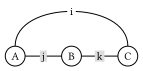
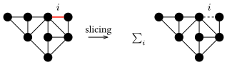

# Tensor Network Contraction Order Optimization

## Tensor network
_Tensor network_ is a powerful tool for modeling and simulating quantum many-body systems, probabilistic inference, combinatorial optimization, etc. It is a diagrammatic representation of tensor _contractions_.
In this representation, a tensor is represented as a node, and an index is represented as a hyperedge (a hyperedge can connect to any number of nodes). For example, vectors, matrices and higher order tensors can be represented as:


To understand the basic concepts of tensor network, we recommend the following references for readers with different background:
* For readers with physics background: [https://tensornetwork.org/diagrams/](https://tensornetwork.org/diagrams/)
* For readers want to get a formal definition: Chapter 2 of [https://epubs.siam.org/doi/abs/10.1137/22M1501787](https://epubs.siam.org/doi/abs/10.1137/22M1501787)

The defining operation of a tensor network is _contraction_, which is also named as sum-product operation. It can be viewed as the generalization of matrix multiplication to tensors. We illustrate tensor network contraction with the following example.

### Example: Trace permutation rule

Let $A, B$ and $C$ be three square matrices with the same size. The trace operation $\text{tr}(A B C)$ is defined as the sum of the products of the elements of the matrices:
```math
\text{tr}(A B C) = \sum_{i,j,k} A_{ij} B_{ik} C_{jk}.
```
It can be represented as a tensor network diagram as follows:



So, each tensor is represented as a node, and each index is represented as an edge. Tensors sharing the same index are connected by the edge. The contraction of the tensor network is the summation of the products of the elements of the tensors over all possible values of the indices.

The contraction can happen in different orders. The famous trace permutation rule states that the trace is invariant under cyclic permutations of the matrices:
```math
\text{tr}(A B C) = \text{tr}(C A B) = \text{tr}(B C A).
```
Hence, we observe that tensor network contraction is associative and commutative, i.e., the order of evaluation does not change the result.
In the tensor network diagram, the order of evaluation is neglected, so the trace permutation rule is trivially satisfied.

By drawing diagrams, we prove the trace permutation rule. Isn't it cool?

## Einsum notation

For simplicity, in the following sections, we will use the einsum notation in [OMEinsum.jl](https://github.com/under-Peter/OMEinsum.jl) to represent the tensor network contraction. It is almost the same as the [numpy einsum notation](https://numpy.org/doc/stable/reference/generated/numpy.einsum.html).
For example, the contraction of the tensor network in the previous trace permutation example can be represented as:
```julia
julia> using OMEinsum

julia> trace_perm = ein"ij, jk, ki -> "
ij, jk, ki ->
```
The string `ij, jk, ki -> ` is the einsum notation, where labels of the input tensors and the output tensor are separated by `->`, and labels of different input tensors are separated by `,`. Here, `ij, jk, ki` are the labels of the input tensors of rank 2 (matrices), and the label of the output tensor is empty, representing a scalar.

Einsum notation is a powerful tool to represent linear operations, e.g. batched matrix multiplication is represented as `ijb,jkb->ikb`, taking diagonal part of a matrix is represented as `ii->i`. Sometimes, a single notation may have thousands or more tensors. Then the contraction order becomes relevant to computational cost of evaluating it.

## Contraction order and complexity
_Contraction order_ is a key factor for the performance of tensor network contraction.
It is represented by a binary tree, where the leaves are the tensors to be contracted and the internal nodes are the intermediate tensors.
The quality of the contraction order is quantified by the _contraction complexity_, which consists of the following metrics
* **time complexity**: the number of floating point operations required to calculate the result;
* **space complexity**: the largest size of the intermediate tensors. For larger tensor networks, the contraction order is important, since it can greatly reduce the time complexity of the calculation.
* **read-write complexity**: the number of times the intermediate tensors are read and written.
The contraction order optimization aims to find the _optimal contraction order_ with the lowest cost, which is usually defined as some linear combination of the above complexities.

Finding the optimal contraction order is NP-complete, but fortunately, a close-to-optimal contraction order is usually good enough, which could be found in a reasonable time with a heuristic optimizer.
In the past decade, methods have been developed to optimize the contraction orders, including both exact ones and heuristic ones.
Among these methods, multiple heuristic methods can handle networks with more than $10^4$ tensors efficiently [^Gray2021], [^Roa2024].

### Example: Optimizing the contraction order with OMEinsum.jl
Considering the following simple tensor network:
```julia
julia> einsum = ein"ij, ik, jl, lk -> "
ij, ik, jl, lk ->
```


Here we simply assume that all indices are of the same dimension $D$.
Then the naive way to calculate the result is to loop over all the indices, which requires $O(D^4)$ operations and no intermediate tensors are produced.

Alternatively, we can contract step by step. We first contraction tensors $A, B \mapsto A B$, and $C, D \mapsto C D$, which produces two rank-2 intermediate tensors, and then contract $A B$ with $C D$ to get the scalar $s$.


It is equivalent to the following einsum notation:
```julia
julia> nested_ein = ein"(ij, ik), (jl, lk) -> "
jk, jk ->
├─ ij, ik -> jk
│  ├─ ij
│  └─ ik
└─ jl, lk -> jk
   ├─ jl
   └─ lk
```
In this way, the total number of operations is $O(2 D^{3} + D^{2})$, which is smaller than the naive calculation, while the trade-off is that we need to store the intermediate tensors $AB$ and $CD$ with size of $O(D^{2})$, as shown below:
```julia
# here we take D = 16
julia> size_dict = uniformsize(einsum, 2^4)

julia> contraction_complexity(einsum, size_dict)
Time complexity: 2^16.0
Space complexity: 2^0.0
Read-write complexity: 2^10.001408194392809

julia> contraction_complexity(nested_ein, size_dict)
Time complexity: 2^13.044394119358454
Space complexity: 2^8.0
Read-write complexity: 2^11.000704269011246
```
We say such a contraction is with **time complexity** of $O(D^{3})$ and **space complexity** of $O(D^{4})$.

In actual calculation, we prefer binary contractions, i.e., contracting two tensors at a time, by converting these two tensors as matrices, so that we can make use of BLAS libraries to speed up the calculation.
In this way, a given contraction order can be represented as a binary tree.
The contraction tree can be represented as a rooted tree, where the leaves are the tensors to be contracted and the internal nodes are the intermediate tensors.
The contraction tree corresponding to the above example is shown below:


Generally speaking, our target is to find a binary contraction order, with minimal time complexity or space complexity, which is called the **optimal contraction order**.

## Tree decomposition and tree width

Finding the optimal contraction order is related to another NP-complete problem: finding the [_tree decomposition_](https://en.wikipedia.org/wiki/Tree_decomposition) of a graph with minimal [_treewidth_](https://en.wikipedia.org/wiki/Treewidth) [^Markov2008].
Tree width is a graph characteristic that measures how similar a graph is to a tree, the lower the tree width, the more similar the graph is to a tree.
The way to relate a graph to a tree is to find a tree decomposition of the graph, which is a tree whose nodes are subsets of the vertices of the graph, and the following conditions are satisfied:

1. Each vertex of the graph is in at least one node of the tree.
2. For each edge of the graph, there is a node of the tree containing both vertices of the edge.
3. Bags containing the same vertex have to be connected in the tree.

All the nodes of the tree are called *tree bags*, and intersection of two bags is called a *separator*.
The width of a tree decomposition is the size of the largest bag minus one.
Clearly, one graph can have multiple tree decomposition with different corresponding widths. The tree width of a graph is the minimal width of all such decompositions, and a particular decomposition (not necessarily unique) that realises this minimal width is called an optimal tree decomposition.
Its width is the tree width of the graph, denoted as $\text{tw}(G)$.

Let $G$ be the hypergraph topology of a tensor network, where a tensor is mapped to a vertex and an index is mapped to an edge. Two tensors are connected if they share a common index.
Instead, if we treat each index as a vertex and each tensor as an edge, we can get its _line graph_ $L(G)$.
Ref.[^Markov2008] shows that the bottleneck time complexity of the contraction of a tensor network is $O(2^{\text{tw}(L(G))})$, where $\text{tw}(L(G))$ is the treewidth of $L(G)$. Therefore, if we can find the tree decomposition of the tensor network with minimal treewidth, we can find the optimal contraction order of the tensor network.

### Example: Line graph and tree decomposition

Consider the einsum notation:
```julia
julia> ein"ABC,BFG,EGH,CDE->"
```
Its graph $G$, its line graph $L(G)$ and its tree decomposition are shown in the following figure:


The tree decomposition in figure (c) is related to the contraction order of the tensor network in the following way:
- By defintion of tree decomposition, each edge of the line graph is contained in at least one tree bag. Hence, every tensor (represented as a hyperedge in $L(G)$) can fit into a tree bag.
- We contract the tensor networks from the leaves to the root. Tensor network contraction requires the indices used in the future steps must be kept in the output tensor. This is automatically satisfied by the third requirement of tree decomposition: If two bags containing two tensors sharing the same index, then this index must appear in all bags between them, such that they can be connected.

As a remark, the tree decomposition considered here handles with weighted vertices. Since we are considering a tensor network, dimension of the indices have to be considered. 
Therefore, for each vertex of the line graph $L(G)$, we define its weight as $\log_2(d)$, where $d$ is the dimension of the index.
In this way, size of a tensor can be represented as the sum of weights of the vertices in $L(G)$.

## Reduce space complexity by slicing

Slicing is a technique to reduce the space complexity of the tensor network by looping over a subset of indices.
This effectively reduces the size of the tensor network inside the loop, and the space complexity can potentially be reduced.
For example, in the following figure, we slice the tensor network over the index $i$. The label $i$ is removed from the tensor network, at the cost of contraction multiple tensor networks.



## References

[^Gray2021]: Gray, Johnnie, and Stefanos Kourtis. "Hyper-optimized tensor network contraction." Quantum 5 (2021): 410.
[^Markov2008]: Markov, I.L., Shi, Y., 2008. Simulating Quantum Computation by Contracting Tensor Networks. SIAM J. Comput. 38, 963–981. https://doi.org/10.1137/050644756
[^Roa2024]: Roa-Villescas, M., Gao, X., Stuijk, S., Corporaal, H., Liu, J.-G., 2024. Probabilistic Inference in the Era of Tensor Networks and Differential Programming. Phys. Rev. Research 6, 033261. https://doi.org/10.1103/PhysRevResearch.6.033261
