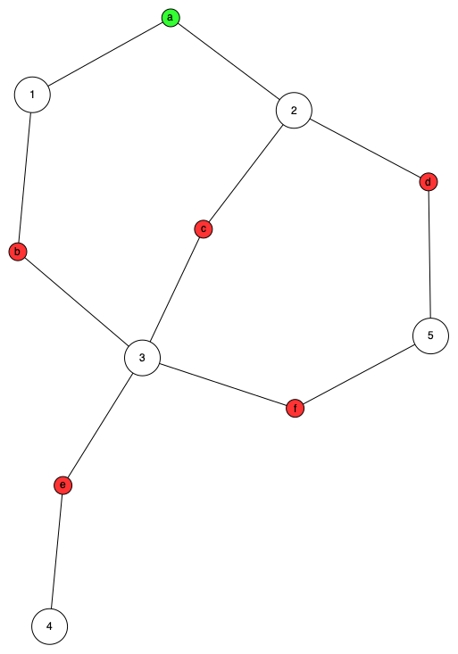

```@meta
CurrentModule = OMEinsumContractionOrders
```

# OMEinsumContractionOrders

This is the documentation for [OMEinsumContractionOrders](https://github.com/TensorBFS/OMEinsumContractionOrders.jl),
a Julia package for the optimization of the contraction order of tensor networks.

**Installation** guide is available in [README.md](https://github.com/TensorBFS/OMEinsumContractionOrders.jl). You can also access its features in [OMEinsum](https://github.com/under-Peter/OMEinsum.jl), which uses it as the default contraction order optimizer.

## Example 1: Use it directly
The contraction order optimizer is implemented in the [`optimize_code`](@ref) function. It takes three arguments: `code`, `size`, and `optimizer`. The `code` argument is the [einsum notation](https://numpy.org/doc/stable/reference/generated/numpy.einsum.html) to be optimized. The `size` argument is the size of the variables in the einsum notation. The `optimizer` argument is the optimizer to be used. The `optimize_code` function returns the optimized contraction order. One can use [`contraction_complexity`](@ref) function to get the time, space and rewrite complexity of returned contraction order.
Supported solvers include:

| Optimizer | Description |
| :----------- | :------------- |
| [`GreedyMethod`](@ref) | Fast, but poor resulting order |
| [`TreeSA`](@ref) | Reliable, local search based optimizer [^Kalachev2021], but is a bit slow |
| [`KaHyParBipartite`](@ref) and [`SABipartite`](@ref) | Graph bipartition based, suited for large tensor networks [^Gray2021], requires using [`KaHyPar`](https://github.com/kahypar/KaHyPar.jl) package |
| [`Treewidth`](@ref) | Tree width solver based, based on package [`CliqueTrees`](https://github.com/AlgebraicJulia/CliqueTrees.jl), performance is elimination algorithm dependent |
| [`ExactTreewidth`](@ref) (alias of `Treewidth{RuleReduction{BT}}`) | Exact, but takes exponential time [^Bouchitté2001], based on package [`TreeWidthSolver`](https://github.com/ArrogantGao/TreeWidthSolver.jl) |
| [`HyperND`](@ref) | Nested dissection algorithm, similar to [`KaHyParBipartite`](@ref). Requires imporing either [`KaHyPar`](https://github.com/kahypar/KaHyPar.jl) or [`Metis`](https://github.com/JuliaSparse/Metis.jl). |

The `KaHyParBipartite` is implemented as an extension. If you have issues in installing `KaHyPar`, please check these issues: [#12](https://github.com/kahypar/KaHyPar.jl/issues/12) and [#19](https://github.com/kahypar/KaHyPar.jl/issues/19).
Additionally, code simplifiers can be used to preprocess the tensor network to reduce the optimization time:

| Simplifier | Description |
| :----------- | :------------- |
| [`MergeVectors`](@ref) | Merges vector tensors with their neighbors |
| [`MergeGreedy`](@ref) | Greedily merges rank non-increasing tensors |

For more details about the contraction order optimization, please refer to the [contraction order](contraction_order.md) page.
Details about the tree width solver can be found in the [tree width](treewidth.md) page.

```@repl
using OMEinsumContractionOrders, Graphs, KaHyPar
function random_regular_eincode(n, k; optimize=nothing)
	g = Graphs.random_regular_graph(n, k)
	ixs = [[minmax(e.src,e.dst)...] for e in Graphs.edges(g)]
	return OMEinsumContractionOrders.EinCode([ixs..., [[i] for i in Graphs.vertices(g)]...], Int[])
end
    
code = random_regular_eincode(100, 3);
contraction_complexity(code, uniformsize(code, 2))

optcode_tree = optimize_code(code, uniformsize(code, 2),
	TreeSA(sc_target=28, βs=0.1:0.1:10, ntrials=2, niters=100, sc_weight=3.0));
contraction_complexity(optcode_tree, uniformsize(code, 2))

optcode_tree_with_slice = optimize_code(code, uniformsize(code, 2),
	TreeSA(sc_target=28, βs=0.1:0.1:10, ntrials=2, niters=20, sc_weight=3.0, nslices=5));

optcode_kahypar = optimize_code(code, uniformsize(code, 2), 
	KaHyParBipartite(sc_target=30, max_group_size=50));
contraction_complexity(optcode_kahypar, uniformsize(code, 2))

optcode_sa = optimize_code(code, uniformsize(code, 2),
	SABipartite(sc_target=30, max_group_size=50));
contraction_complexity(optcode_sa, uniformsize(code, 2))
```

## Example 2: Use it in `OMEinsum`

`OMEinsumContractionOrders` is shipped with [`OMEinsum`](https://github.com/under-Peter/OMEinsum.jl) package. You can use it to optimize the contraction order of an `OMEinsum` expression.

```@repl
using OMEinsum

code = ein"ij, jk, kl, il->"

optimized_code = optimize_code(code, uniformsize(code, 2), TreeSA())
```

For multi-GPU contraction of tensor networks, please check [this Gist](https://gist.github.com/GiggleLiu/d5b66c9883f0c5df41a440589983ab99).

## Example 3: Visualization

### LuxorTensorPlot

`LuxorTensorPlot` is an extension of the `OMEinsumContractionOrders` package that provides a visualization of the contraction order. It is designed to work with the `OMEinsumContractionOrders` package. To use `LuxorTensorPlot`, please follow these steps:
```julia
pkg> add OMEinsumContractionOrders, LuxorGraphPlot

julia> using OMEinsumContractionOrders, LuxorGraphPlot
```
and then the extension will be loaded automatically.

The extension provides the following to function, `viz_eins` and `viz_contraction`, where the former will plot the tensor network as a graph, and the latter will generate a video or gif of the contraction process.
Here is an example:
```julia-repl
julia> using OMEinsumContractionOrders, LuxorGraphPlot

julia> eincode = OMEinsumContractionOrders.EinCode([['a', 'b'], ['a', 'c', 'd'], ['b', 'c', 'e', 'f'], ['e'], ['d', 'f']], ['a'])
ab, acd, bcef, e, df -> a

julia> viz_eins(eincode, filename = "eins.png")

julia> nested_eins = optimize_code(eincode, uniformsize(eincode, 2), GreedyMethod())
ab, ab -> a
├─ ab
└─ acf, bcf -> ab
   ├─ acd, df -> acf
   │  ├─ acd
   │  └─ df
   └─ bcef, e -> bcf
      ├─ bcef
      └─ e


julia> viz_contraction(nested_code)
[ Info: Generating frames, 7 frames in total
[ Info: Creating video at: /var/folders/3y/xl2h1bxj4ql27p01nl5hrrnc0000gn/T/jl_SiSvrH/contraction.mp4
"/var/folders/3y/xl2h1bxj4ql27p01nl5hrrnc0000gn/T/jl_SiSvrH/contraction.mp4"
```

The resulting image and video will be saved in the current working directory, and the image is shown below:
```@raw html
<div style="text-align:center">
	
</div>
```
The large white nodes represent the tensors, and the small colored nodes represent the indices, red for closed indices and green for open indices.

[^Bouchitté2001]: Bouchitté, V., Todinca, I., 2001. Treewidth and Minimum Fill-in: Grouping the Minimal Separators. SIAM J. Comput. 31, 212–232. https://doi.org/10.1137/S0097539799359683
[^Gray2021]: Gray, Johnnie, and Stefanos Kourtis. "Hyper-optimized tensor network contraction." Quantum 5 (2021): 410.
[^Kalachev2021]: Kalachev, Gleb, Pavel Panteleev, and Man-Hong Yung. "Recursive multi-tensor contraction for XEB verification of quantum circuits." arXiv preprint arXiv:2108.05665 (2021).
