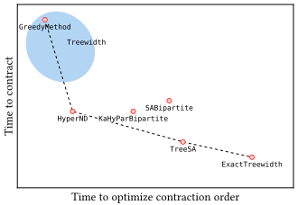
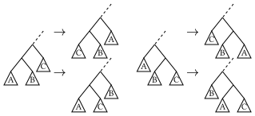
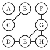
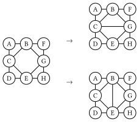

# Choosing Optimizers

Supported solvers include:

| Optimizer | Description |
| :----------- | :------------- |
| [`GreedyMethod`](@ref Sec_GreedyMethod) | Fast, but poor contraction order |
| [`TreeSA`](@ref Sec_TreeSA) | Reliable, local search based optimizer [^Kalachev2021], but is a bit slow |
| [`HyperND`](@ref Sec_HyperND) | Nested dissection algorithm, similar to [`KaHyParBipartite`](@ref). Requires importing either [`KaHyPar`](https://github.com/kahypar/KaHyPar.jl) or [`Metis`](https://github.com/JuliaSparse/Metis.jl). |
| [`KaHyParBipartite` and `SABipartite`](@ref Sec_Bipartite) | Graph bipartition based, suited for large tensor networks [^Gray2021], requires using [`KaHyPar`](https://github.com/kahypar/KaHyPar.jl) package. Alternatively, a simulated annealing bipartition method is provided in [`SABipartite`](@ref). |
| [`ExactTreewidth`](@ref Sec_ExactTreewidth) (alias of `Treewidth{RuleReduction{BT}}`) | Exact, but takes exponential time [^Bouchitté2001], based on package [`TreeWidthSolver`](https://github.com/ArrogantGao/TreeWidthSolver.jl). |
| [`Treewidth`](@ref Sec_Treewidth) | Tree width solver based, based on package [`CliqueTrees`](https://github.com/AlgebraicJulia/CliqueTrees.jl), performance is elimination algorithm dependent. |

The `KaHyParBipartite` is implemented as an extension. If you have issues in installing `KaHyPar`, please check these issues: [#12](https://github.com/kahypar/KaHyPar.jl/issues/12) and [#19](https://github.com/kahypar/KaHyPar.jl/issues/19).

There is a tradeoff between the time and the quality of the contraction order. The following figure shows the Pareto front of the multi-objective optimization of the time to optimize the contraction order and the time to contract the tensor network.



Among these methods, the `ExactTreewidth` method produces the lowest treewidth, but it does not scale up to tensor networks with more than 50 tensors. The `TreeSA` is the second best in terms of the treewidth. It works well in most cases, and supports [slicing](@ref "Reduce space complexity by slicing").
The only limitation is that it is a bit slow.
For application sensitive to overhead, the `GreedyMethod` and `Treewidth` method (blue region) are recommended.
The `Treewidth` method is a zoo of methods provided by the package [`CliqueTrees`](https://github.com/AlgebraicJulia/CliqueTrees.jl), which is a collection of methods for finding the approximate tree decomposition of a graph. Most of them have similar performance with the `GreedyMethod`, and most of them are very efficient. The `HyperND` method has a very good overall performance in benchmarks (to be added), and it is much faster than the `TreeSA` method. It relies on the `KaHyPar` package, which is platform picky.

## [`GreedyMethod`](@id Sec_GreedyMethod)
Implemented as [`GreedyMethod`](@ref) in the package.
The Greedy method is one of the simplest and fastest method for optimizing the contraction order. The idea is to greedily select the pair of tensors with the smallest cost to contract at each step.
The cost is defined as:
```math
L = \text{size}(\text{out}) - α \times (\text{size}(\text{in}_1) + \text{size}(\text{in}_2))
```
where $\text{out}$ is the output tensor, and $\text{in}_1$ and $\text{in}_2$ are the input tensors. $α$ is a hyperparameter, which is set to $0.0$ by default, meaning that we greedily select the pair of tensors with the smallest size of the output tensor. For $\alpha = 1$, the size increase in each step is greedily optimized.

## [`TreeSA`](@id Sec_TreeSA)

Implemented as [`TreeSA`](@ref) in the package.
The local search method [^Kalachev2021] is a heuristic method based on the idea of simulated annealing.
The method starts from a random contraction order and then applies the following four possible transforms as shown in the following figure



They correspond to the different ways to contract three sub-networks:
```math
(A * B) * C = (A * C) * B = (C * B) * A, \\
A * (B * C) = B * (A * C) = C * (B * A),
```
where we slightly abuse the notation "$*$" to denote the tensor contraction, and $A, B, C$ are the sub-networks to be contracted.
Due to the commutative property of the tensor contraction, such transformations do not change the result of the contraction.
Even through these transformations are simple, all possible contraction orders can be reached from any initial contraction order.
The local search method starts from a random contraction tree.
In each step, the above rules are randomly applied to transform the tree and then the cost of the new tree is evaluated, which is defined as
```math
\mathcal{L} = \text{tc} + w_s \times \text{sc} + w_{\text{rw}} \times \text{rwc},
```
where $w_s$ and $w_{\text{rw}}$ are the weights of the space complexity and read-write complexity compared to the time complexity, respectively.
The optimal choice of weights depends on the specific device and tensor contraction algorithm. One can freely tune the weights to achieve a best performance for their specific problem.
Then the transformation is accepted with a probability given by the Metropolis criterion, which is
```math
p_{\text{accept}} = \min(1, e^{-\beta \Delta \mathcal{L}}),
```
where $\beta$ is the inverse temperature, and $\Delta \mathcal{L}$ is the difference of the cost of the new and old contraction trees.
During the process, the temperature is gradually decreased, and the process stop when the temperature is low enough.
Additionally, the `TreeSA` method supports the slicing technique.
When the space complexity is too large, one can loop over a subset of indices, and then contract the intermediate results in the end.
Such technique can reduce the space complexity, but slicing $n$ indices will increase the time complexity by $2^n$.


## [`HyperND`](@id Sec_HyperND)

Implemented as [`HyperND`](@ref) in the package.


## [`KaHyParBipartite` and `SABipartite`](@id Sec_Bipartite)

Implemented as [`KaHyParBipartite`](@ref) and [`SABipartite`](@ref) in the package.
A given tensor network can be regarded as a hypergraph, where the tensors are the vertices and the shared indices are the hyperedges, and the cost of contracting a hyper edge can be encoded as its weight. The binary partition method is to partition the hypergraph into two parts, and then recursively partition each part. Cost of each partition can be evaluated by the sum of the weights of the hyperedges cut by the partition, while we prefer to make the partition as balanced as possible (balance means size of the subgraph should be similar). Thus, the problem is reduced to a balanced min cut problem on a hypergraph. In the past few decades, the graph community has developed many algorithms for the balanced min cut problem and provided the corresponding software packages, such as KaHyPar[^Schlag2021].

## [`ExactTreewidth`](@id Sec_ExactTreewidth)

Implemented as [`ExactTreewidth`](@ref) in the package.
This method is a technical note for the [Google Summer of Code 2024](https://summerofcode.withgoogle.com) project ["Tensor network contraction order optimization and visualization"](https://summerofcode.withgoogle.com/programs/2024/projects/B8qSy9dO) released by **The Julia Language**, where I developed a package [TreeWidthSolver.jl](https://github.com/ArrogantGao/TreeWidthSolver.jl) for calculating the tree decomposition with minimal treewidth of a given simple graph and made it a backend of [OMEinsumContracionOrders.jl](https://github.com/TensorBFS/OMEinsumContractionOrders.jl).


In the previous section, we introduce the concept of tensor network and its contraction order, so that now you should understand why the contraction order so important. 
Then the next question is how to find the optimal contraction order.

In our work, we propose to use the tree decomposition of the line graph of the hypergraph representation of the tensor network to find the optimal contraction order, according to the following well known theorem[Markov](https://doi.org/10.1137/050644756) :

**Theorem 1**. Let $C$ be a quantum circuit with $T$ gates and whose underlying circuit graph is $G_c$. Then $C$ can be simulated deterministically in time $T^{O(1)} e^{O(tw(G_C))}$, where $tw(G_C)$ is the treewidth of $G_C$.

Using the language of tensor network, we can rewrite the above theorem as follows: the bottleneck of time complexity of the contraction of a tensor network is $O(e^{O(tw(L(G)))})$, where $L(G)$ is the line graph of the hypergraph representation of the tensor network. 
Therefore, if we can find the tree decomposition of the tensor network with minimal treewidth, we can find the optimal contraction order of the tensor network.
We developed a package [TreeWidthSolver.jl](https://github.com/ArrogantGao/TreeWidthSolver.jl) for finding the optimal tree decomposition of a given simple graph, which can be used as a backend of [OMEinsumContractionOrders.jl](https://github.com/TensorBFS/OMEinsumContractionOrders.jl).
For more details about the tree decomposition and its relation to the contraction order, please refer to the appendix.

Here is an example of usage:
```julia
julia> using OMEinsum, OMEinsumContractionOrders

# define the contraction using Einstein summation
julia> code = ein"ijl, ikm, jkn, l, m, n -> "
ijl, ikm, jkn, l, m, n -> 

ulia> optimizer = ExactTreewidth()
ExactTreewidth{GreedyMethod{Float64, Float64}}(GreedyMethod{Float64, Float64}(0.0, 0.0, 1))

# set the size of the indices
julia> size_dict = uniformsize(code, 2)
Dict{Char, Int64} with 6 entries:
  'n' => 2
  'j' => 2
  'i' => 2
  'l' => 2
  'k' => 2
  'm' => 2

julia> optcode = optimize_code(code, size_dict, optimizer)
n, n -> 
├─ jk, jkn -> n
│  ├─ ij, ik -> jk
│  │  ├─ ijl, l -> ij
│  │  │  ├─ ijl
│  │  │  └─ l
│  │  └─ ikm, m -> ik
│  │     ├─ ikm
│  │     └─ m
│  └─ jkn
└─ n

# check the complexity
julia> contraction_complexity(optcode, size_dict)
Time complexity: 2^5.087462841250339
Space complexity: 2^2.0
Read-write complexity: 2^5.882643049361841

# check the results
julia> A = rand(2, 2, 2); B = rand(2, 2, 2); C = rand(2, 2, 2); D = rand(2); E = rand(2); F = rand(2);

julia> code(A, B, C, D, E, F) ≈ optcode(A, B, C, D, E, F)
true
```

This optimizer will be used as an extension of [TensorOperations.jl](https://github.com/Jutho/TensorOperations.jl) in the future, see this [PR](https://github.com/Jutho/TensorOperations.jl/pull/185).
We compared the performance of this method against the default optimizer of TensorOperations.jl based on exhaustive searching, the results is shown below.


The results shown that the tree width based solver is faster for some graph similar to trees.
For more details, please see the benchmark repo: [https://github.com/ArrogantGao/TreeWidthSolver_benchmark](https://github.com/ArrogantGao/TreeWidthSolver_benchmark).


### The Bouchitté–Todinca Algorithm for Exact Tree Width

Various algorithms have been developed to calculate the treewidth of a graph in the past few decades, both exactly and approximately.
In this section, I will introduce one of the most basic exact algorithms: the Bouchitté–Todinca (BT) algorithm [Bouchitte](https://doi.org/10.1137/S0097539799359683) [BouchitteListing](https://doi.org/10.1016/S0304-3975(01)00007-X) [Tuukka](https://tuukkakorhonen.com/papers/msc-thesis.pdf), which makes use of the theory of minimal triangulations, characterizing the minimal triangulations of a graph via objects called minimal separators and potential maximal cliques of the graph.

### Triangulation and Minimal Triangulation

First of all, let's introduce the concept of triangulation and minimal triangulation.

Triangulations of graphs are a central graph-theoretic concept in the computation of tree decompositions. 
Triangulations are defined via *chordality* of graphs. 
A graph G is chordal if every cycle in $G$ with at least $4$ vertices contains a chord, which is an edge that is not part of the cycle but connects two vertices of the cycle
Correspondingly, a non-chordal graph has at least one chordless cycle, i.e., a cycle with at least $4$ vertices that does not have a chord.

**Definition 2** (triangulation). A graph $H$ is a triangulation of a graph $G$ if $H$ is chordal, $V (G) = V (H)$, and $E(G) \subseteq E(H)$.

Here is an example of a triangulation of a graph:


where the left graph is the original graph and the right one is a triangulation of the graph.


### Minimal Separator and Potential Maximal Cliques

Then we can introduce the concept of minimal separator and potential maximal cliques.

A set of vertices $S \subseteq V (G)$ is an $a,b$-separator of a graph $G$ if the vertices $a$ and $b$ are in different connected components of $G \setminus S$. 
In other words, all paths between $a$ and $b$ go through $S$. The set $S$ is a minimal $a,b$-separator of $G$ if no subset of $S$ is also an $a,b$-separator.
The minimal separator of a graph is defined as follows:

**Defination 3** (minimal separator): Let $G$ be a graph. A set of vertices $S \subseteq V (G)$ is a minimal separator of $G$ if it is a minimal $a,b$-separator for some pair $a, b \in V (G)$.

For example, in the graph shown above, the set $\{B, C\}$ is a minimal separator of the graph, which separates the graph into two disconnected parts: $\{A\}$ and $\{D, E, F, G, H\}$.
It is also easy to see that the set $\{B,C\}$ is exactly the intersection of the two neighboring bags $\{A, B, C\}$ and $\{B, C, E\}$ in the tree decomposition.
Actually, all intersection of neighboring bags in a tree decomposition is a separator of the graph.



**Defination 4** (potential maximal clique): A set of vertices $\Omega \subseteq V (G)$ is a potential maximal clique of a graph $G$ if there is a minimal triangulation $H$ of $G$ such that $\Omega$ is a maximal clique of $H$. A set of vertices is a maximal clique if it is a clique and no strict superset of it is a clique.

For example, in the graph shown above, the sets $\{B,C,E\}$, $\{B,G,E\}$, $\{B,C,G\}$ and $\{C, E, G\}$ are all potential maximal cliques of the graph, corresponding to different triangulations of the graph:




### The Bouchitté–Todinca Dynamic Programming Algorithm

The reason that we are interested in minimal separators and potential maximal cliques the following properties of the optimal tree decomposition:
* All tree bags of a tree decomposition with minimal treewidth are potential maximal cliques of the graph.
* The intersection of any two neighboring bags in a tree decomposition is a minimal separator of the graph.
Based on these properties, the Bouchitté–Todinca algorithm first calculates all minimal separators and potential maximal cliques of the graph, and then uses dynamic programming to find a set of potential maximal cliques that minimizes the width of the tree decomposition.

In this section, I will introduce the Bouchitté–Todinca algorithm in detail, which can be separated into the following steps:
* List all minimal separators, $\Delta$;
* List all potential maximal cliques, $\Pi$;
* Calculate the treewidth of the graph.

#### Step 1: List all minimal separators

To recognize minimal separators of a graph, we mainly use the following property.

For a set of vertices $S$, consider the connected components of $G \setminus S$, represented as $\mathcal{C}(G \setminus S)$, which are called the components of $S$.
For $C \in \mathcal{C}(G \setminus S)$, if $N(C) = S$, then $C$ is called a full-component of $S$.

**Theorem 1** (minimal separator): The set $S$ is a minimal separator if and only if it has two or more than two full-components.

For example, $\{B, C\}$ is a minimal separator of the graph shown above, with two full-components $\{A\}$ and $\{D, E, F, G, H\}$.
While $\{B, C, F\}$ is not, since it has only one full-component $\{D, E, G, H\}$.

It is shown that the following proposition holds:

**Proposition 1**: Let $S$ be a minimal separator of a graph $G$ and $a$ a vertex of $G$, then neighbors of the connected components of $G \setminus (S \cup \{a\})$, i.e.
$$ \mathcal{R}(S) = \{N(C) | C \in \mathcal{C}(G \setminus (S \cup \{a\}))\} $$
are all minimal separators of the graph.

Then we start from all vertices $v$ of the graph and theirs neighbor $N(v)$, and repeatedly apply the proposition above to list all minimal separators of the graph.

#### Step 2: List all potential maximal cliques

In the second step we list all potential maximal cliques of the graph using $\Delta$ calculated in the first step.
To check a set of vertices $\Omega$ is a potential maximal clique, we can use the following property:

**Theorem 2** (potential maximal clique): Let $\Omega$ be a set of vertices of a graph $G$. The set $\Omega$ is a potential maximal clique if and only if the following conditions hold:
* for any pair of vertices $a, b \in \Omega$, either $a$ and $b$ are connected by an edge in the graph, or there is a minimal separator $S$ such that $a \in S$ and $b \in S$;
* no component of $\Omega$ is full;
where the first one is called the *cliquish condition*, and the second one is called the *non-full condition*.

Then, one can use the following rules to list all potential maximal cliques: 

**Proposition 2**: Let $\Omega$ be a potential maximal clique and $a$ a vertex of $G$, and $a$ is a vertex of $G$.
If $V(G) \geq 2$, one of the following conditions holds:
1. $\Omega \setminus \{a\} \in \Pi(G \setminus \{a\})$;
2. $\Omega \setminus \{a\} \in \Delta(G)$;
3. $\Omega = S \cup T \setminus \{a\}$, where $S$ and $T$ are minimal separators of $G$ such that $a \notin S$, $S \notin \Delta(G \setminus \{a\})$ and $a \in T$.

The proposition indicates that with $\Pi(G \setminus \{a\})$, $\Delta(G \setminus \{a\})$ and $\Delta(G)$, one can construct $\Pi(G)$ by adding one vertex $a$ to the graph.

Then one can iteratively construct the graph by adding one vertex each time, here we represent the $i$-th graph as $G_i = G(\{v_1, v_2, \cdots, v_i\})$, and then calculate $\Pi(G_i)$ using $\Pi(G_{i-1})$, $\Delta(G_{i-1})$ and $\Delta(G_i)$ according to the proposition above, until $i = N$ and all potential maximal cliques are found.

#### Step 3: Calculate the treewidth of the graph

Finally, we can calculate the treewidth of the graph using $\Delta$ and $\Pi$ calculated in the first two steps.

The BT algorithm is based on the following two ideas: 
1. all tree bags of the tree decomposition with minimal treewidth are potential maximal cliques of the graph;
2. tree width of a graph is larger than that of its subgraphs.

Then for a given potential maximal clique $\Omega$, the minimal treewidth among all tree decompositions with $\Omega$ is given by
$$tw(\Omega) = \max(|\Omega| - 1, tw(G(C_i \cup S_i))),~C_i \in \mathcal{C}(G \setminus \Omega),~S_i = C_i \cap \Omega,$$
and the treewidth of the graph is the minimum of $tw(\Omega)$ among all potential maximal cliques $\Omega$.

For example, in the figure below, we assume that the potential maximal clique $\Omega = \{B, C, E\}$ with width $2$ is in the decomposition, and then we need to compare that against the width of the subgraphs $G(\{A, B, C\})$, $G(\{C, D, E\})$ and $G(\{B, E, F, G, H\})$.
Since $\{A, B, C\}$ and $\{C, D, E\}$ are already potential maximal cliques, theirs width is $2$; and for $G(\{B, E, F, G, H\})$, we can apply a similar procedure to calculate the width of the subgraphs, which is also $2$.
Thus $tw(\{B, C, E\}) = 2$.
By comparing width of all possible choices of $\Omega$, we can find the treewidth of the graph.

The BT algorithm first calculates all possible $G(C \cup S)$ for all $\Omega$ and sort the triplets $(\Omega, C, S)$ according to size of $C \cup S$.
Then with the help of dynamic programming, the algorithm calculate width of subgraph $G(C \cup S)$ from the smallest to the largest.
In each step, treewidth of all possible subgraphs of the current graph $G(C \cup S)$ is already calculated, so that the treewidth of $G(C \cup S)$ can be directly obtain by comparing the width of the subgraphs and $|\Omega| - 1$.

Furthermore, if the choice of $\Omega$ of each step is stored, the tree decomposition can be easily obtained by connecting these potential maximal cliques.

Using the BT algorithm, one can calculate the treewidth of a graph exactly, and the algorithm has a time complexity of $O(|\Pi|nm)$, which are dependent on the graph structure.


## [`Treewidth`](@id Sec_Treewidth)

Implemented as [`Treewidth`](@ref) in the package.

## Exhaustive Search (planned)

The exhaustive search [^Robert2014] is a method to get the exact optimal contraction complexity.
There are three different ways to implement the exhaustive search:
* **Depth-first constructive approach**: in each step, choose a pair of tensors to contract a new tensor until all tensors are contracted, and then iterate over all possible contraction sequences without duplication. Note the cheapest contraction sequence thus found.
* **Breadth-first constructive approach**: the breadth-first method construct the set of intermediate tensors by contracting $c$ tensors ($c \in [1, n - 1]$, where $n$ is the number of tensors) in each step, and record the optimal cost for constructing each intermediate tensor. Then in the last step, the optimal cost for contracting all $n$ tensors is obtained.
* **Dynamic programming**: in each step, consider all bipartition that split the tensor network into two parts, if the optimal cost for each part is not recorded, further split them until the cost has been already obtained or only one tensor is left. Then combine the two parts and record the optimal cost of contracting the sub-networks. In this end the optimal cost for the whole network is obtained.
In more recent work [^Robert2014], by reordering the search process in favor of cheapest-first and excluding large numbers of outer product contractions which are shown to be unnecessary, the efficiency of the exhaustive search has been greatly improved.
The method has been implemented in [TensorOperations.jl](https://github.com/Jutho/TensorOperations.jl).

## Performance Benchmark

### Compare `ExactTreewidth` and exhaustive search

We benchmarked the package on a set of random graphs with different sizes, including the 3-regular graph, line graph and random tree graph, and the results are shown below:


where $n$ is the number of vertices of the graph, $T$ is the time used to calculate the treewidth of the graph.
Results for the 3-regular graph and random tree graph are averaged over $10$ samples.
The results show that for different types of graphs, the time used to calculate the treewidth can be quite different, and the time complexity of the algorithm is dependent on the graph structure.
For simple line/tree graphs, the BT algorithm can reach a polynomial time complexity and calculate the treewidth of the graph in a short time, while for more complex graphs, the time used can be much longer.
It has been proved that the upper bound of this algorithm is about $O(1.7^n)$.

The following figure shows a comparison with the exhaustive search in TensorOperations.jl:


The results shown that the tree width based solver is faster for some graph similar to trees.
For more details, please see the benchmark repo: [https://github.com/ArrogantGao/TreeWidthSolver_benchmark](https://github.com/ArrogantGao/TreeWidthSolver_benchmark).

## References

[^Bouchitté2001]: Bouchitté, V., Todinca, I., 2001. Treewidth and Minimum Fill-in: Grouping the Minimal Separators. SIAM J. Comput. 31, 212–232. https://doi.org/10.1137/S0097539799359683
[^Gray2021]: Gray, Johnnie, and Stefanos Kourtis. "Hyper-optimized tensor network contraction." Quantum 5 (2021): 410.
[^Kalachev2021]: Kalachev, Gleb, Pavel Panteleev, and Man-Hong Yung. "Recursive multi-tensor contraction for XEB verification of quantum circuits." arXiv preprint arXiv:2108.05665 (2021).
[^Robert2014]: Pfeifer, R.N.C., Haegeman, J., Verstraete, F., 2014. Faster identification of optimal contraction sequences for tensor networks. Phys. Rev. E 90, 033315. https://doi.org/10.1103/PhysRevE.90.033315
[^Schlag2021]: Schlag, S., Heuer, T., Gottesbüren, L., Akhremtsev, Y., Schulz, C., Sanders, P., 2021. High-Quality Hypergraph Partitioning. https://doi.org/10.48550/arXiv.2106.08696
