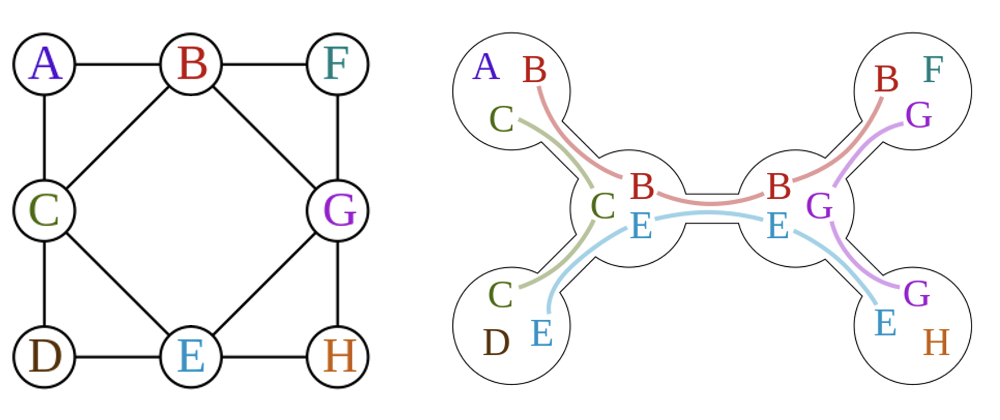
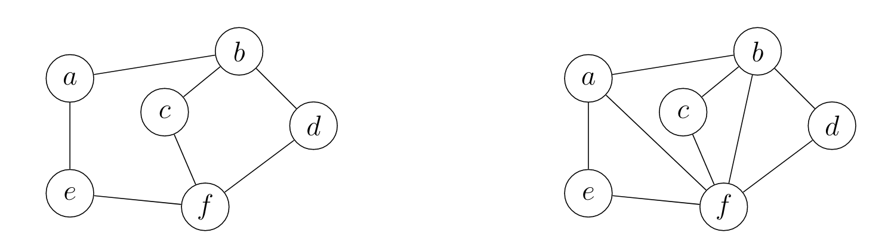
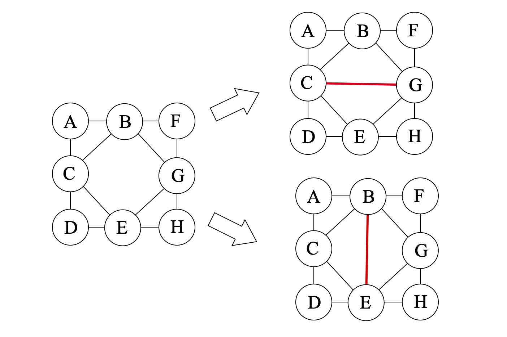
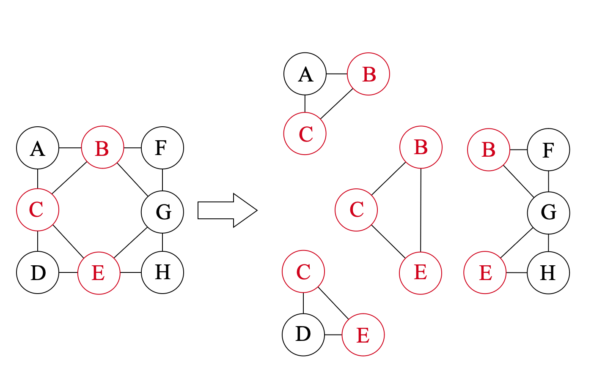
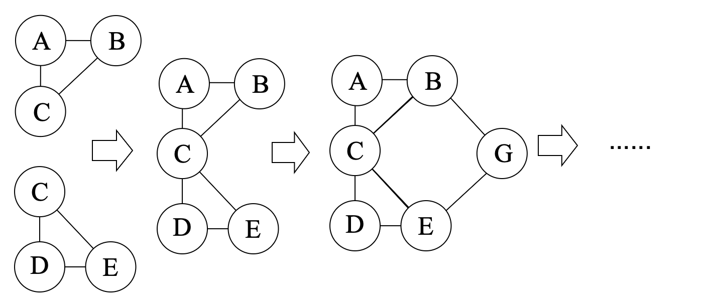

# Finding the Optimal Tree Decomposition with Minimal Treewidth

This blog detailed introduce the algorithm to find the optimal tree decomposition with minimal treewidth of a given simple graph, and how it is implemented in Julia package [TreeWidthSolver.jl](https://github.com/ArrogantGao/TreeWidthSolver.jl).

The following is the outline of this blog:
* Tree width and tree decomposition
* The Bouchitté–Todinca algorithm for exact tree width
* A Julia implementation: TreeWidthSolver.jl

## Tree Width and Tree Decomposition

In this section, I will introduce the basic concepts of tree width and tree decomposition.

Intuitively, a [**tree decomposition**](https://en.wikipedia.org/wiki/Tree_decomposition) represents the vertices of a given graph $G$ as subtrees of a tree, in such a way that vertices in $G$ are adjacent only when the corresponding subtrees intersect.

**Defination 1** (tree decomposition): The tree decomposition of a graph is a tree whose nodes are subsets of the vertices of the graph, and the following conditions are satisfied:

1. Each vertex of the graph is in at least one node of the tree.
2. For each edge of the graph, there is a node of the tree containing both vertices of the edge.
3. Bags containing the same vertex have to be connected in the tree.

An example of tree decomposition is shown in the following figure:


 
where the left graph is the original graph and the right one is the tree decomposition of the graph.

The nodes of the tree are called **tree bags**.
The width of a tree decomposition is the size of the largest bag minus one, thus the width of the example above is $2$.
Clearly, one graph can have multiple tree decompositions, and the **tree width** of a graph is the minimum width of all possible tree decompositions.

Tree decompositions play an important role in graph theory and combinatorial optimization, many NP-hard problems such as maximum independent set, minimum dominating set, chromatic number, and Hamiltonicity can be solved with dynamic programming over a tree decomposition, with a running time exponential in the width of the decomposition but linear in the size of the graph
For our purpose, tree decompositions can be used to optimize the contraction order of tensor networks, which is a key step in many quantum many-body simulations.
However, find the optimal tree decomposition with minimal treewidth is also an NP-hard problem.
In the following sections, I will introduce an exact algorithm to calculate the treewidth of a graph.

Another important concept is the **vertex elimination order**, which can be obtained from the tree decomposition.
An example is shown below, where the tree decomposition of the graph above is formulated as a tree by selecting one of the tree bag as root.
Then a vertex is eliminated if it exists in child bags but not in the parent bag, and the elimination order is the order of the vertices being eliminated, and child of the same parent can be eliminated in arbitrary order.
In this example, the elimination order is $\{\{A, B, C\}, \{D\}, \{G\}, \{F\}, \{H\}\}$, where the last is the first to be eliminated.


## The Bouchitté–Todinca Algorithm for Exact Tree Width

Various algorithms have been developed to calculate the treewidth of a graph in the past few decades, both exactly and approximately.
In this section, I will introduce one of the most basic exact algorithms: the Bouchitté–Todinca (BT) algorithm [Bouchitte](https://doi.org/10.1137/S0097539799359683) [BouchitteListing](https://doi.org/10.1016/S0304-3975(01)00007-X) [Tuukka](https://tuukkakorhonen.com/papers/msc-thesis.pdf), which makes use of the theory of minimal triangulations, characterizing the minimal triangulations of a graph via objects called minimal separators and potential maximal cliques of the graph.

### Triangulation and Minimal Triangulation

First of all, let's introduce the concept of triangulation and minimal triangulation.

Triangulations of graphs are a central graph-theoretic concept in the computation of tree decompositions. 
Triangulations are defined via *chordality* of graphs. 
A graph G is chordal if every cycle in $G$ with at least $4$ vertices contains a chord, which is an edge that is not part of the cycle but connects two vertices of the cycle
Correspondingly, a non-chordal graph has at least one chordless cycle, i.e., a cycle with at least $4$ vertices that does not have a chord.

**Definition 2** (triangulation). A graph $H$ is a triangulation of a graph $G$ if $H$ is chordal, $V (G) = V (H)$, and $E(G) \subseteq E(H)$.

Here is an example of a triangulation of a graph:



where the left graph is the original graph and the right one is a triangulation of the graph.


### Minimal Separator and Potential Maximal Cliques

Then we can introduce the concept of minimal separator and potential maximal cliques.

A set of vertices $S \subseteq V (G)$ is an $a,b$-separator of a graph $G$ if the vertices $a$ and $b$ are in different connected components of $G \setminus S$. 
In other words, all paths between $a$ and $b$ go through $S$. The set $S$ is a minimal $a,b$-separator of $G$ if no subset of $S$ is also an $a,b$-separator.
The minimal separator of a graph is defined as follows:

**Defination 3** (minimal separator): Let $G$ be a graph. A set of vertices $S \subseteq V (G)$ is a minimal separator of $G$ if it is a minimal $a,b$-separator for some pair $a, b \in V (G)$.

For example, in the graph shown above, the set $\{B, C\}$ is a minimal separator of the graph, which separates the graph into two disconnected parts: $\{A\}$ and $\{D, E, F, G, H\}$.
It is also easy to see that the set $\{B,C\}$ is exactly the intersection of the two neighboring bags $\{A, B, C\}$ and $\{B, C, E\}$ in the tree decomposition.
Actually, all intersection of neighboring bags in a tree decomposition is a separator of the graph.


**Defination 4** (potential maximal clique): A set of vertices $\Omega \subseteq V (G)$ is a potential maximal clique of a graph $G$ if there is a minimal triangulation $H$ of $G$ such that $\Omega$ is a maximal clique of $H$. A set of vertices is a maximal clique if it is a clique and no strict superset of it is a clique.

For example, in the graph shown above, the sets $\{B,C,E\}$, $\{B,G,E\}$, $\{B,C,G\}$ and $\{C, E, G\}$ are all potential maximal cliques of the graph, corresponding to different triangulations of the graph:




### The Bouchitté–Todinca Dynamic Programming Algorithm

The reason that we are interested in minimal separators and potential maximal cliques the following properties of the optimal tree decomposition:
* All tree bags of a tree decomposition with minimal treewidth are potential maximal cliques of the graph.
* The intersection of any two neighboring bags in a tree decomposition is a minimal separator of the graph.
Based on these properties, the Bouchitté–Todinca algorithm first calculates all minimal separators and potential maximal cliques of the graph, and then uses dynamic programming to find a set of potential maximal cliques that minimizes the width of the tree decomposition.

In this section, I will introduce the Bouchitté–Todinca algorithm in detail, which can be separated into the following steps:
* List all minimal separators, $\Delta$;
* List all potential maximal cliques, $\Pi$;
* Calculate the treewidth of the graph.

#### Step 1: List all minimal separators

To recognize minimal separators of a graph, we mainly use the following property.

For a set of vertices $S$, consider the connected components of $G \setminus S$, represented as $\mathcal{C}(G \setminus S)$, which are called the components of $S$.
For $C \in \mathcal{C}(G \setminus S)$, if $N(C) = S$, then $C$ is called a full-component of $S$.

**Theorem 1** (minimal separator): The set $S$ is a minimal separator if and only if it has two or more than two full-components.

For example, $\{B, C\}$ is a minimal separator of the graph shown above, with two full-components $\{A\}$ and $\{D, E, F, G, H\}$.
While $\{B, C, F\}$ is not, since it has only one full-component $\{D, E, G, H\}$.

It is shown that the following proposition holds:

**Proposition 1**: Let $S$ be a minimal separator of a graph $G$ and $a$ a vertex of $G$, then neighbors of the connected components of $G \setminus (S \cup \{a\})$, i.e.
$$ \mathcal{R}(S) = \{N(C) | C \in \mathcal{C}(G \setminus (S \cup \{a\}))\} $$
are all minimal separators of the graph.

Then we start from all vertices $v$ of the graph and theirs neighbor $N(v)$, and repeatedly apply the proposition above to list all minimal separators of the graph.

#### Step 2: List all potential maximal cliques

In the second step we list all potential maximal cliques of the graph using $\Delta$ calculated in the first step.
To check a set of vertices $\Omega$ is a potential maximal clique, we can use the following property:

**Theorem 2** (potential maximal clique): Let $\Omega$ be a set of vertices of a graph $G$. The set $\Omega$ is a potential maximal clique if and only if the following conditions hold:
* for any pair of vertices $a, b \in \Omega$, either $a$ and $b$ are connected by an edge in the graph, or there is a minimal separator $S$ such that $a \in S$ and $b \in S$;
* no component of $\Omega$ is full;
where the first one is called the *cliquish condition*, and the second one is called the *non-full condition*.

Then, one can use the following rules to list all potential maximal cliques: 

**Proposition 2**: Let $\Omega$ be a potential maximal clique and $a$ a vertex of $G$, and $a$ is a vertex of $G$.
If $V(G) \geq 2$, one of the following conditions holds:
1. $\Omega \setminus \{a\} \in \Pi(G \setminus \{a\})$;
2. $\Omega \setminus \{a\} \in \Delta(G)$;
3. $\Omega = S \cup T \setminus \{a\}$, where $S$ and $T$ are minimal separators of $G$ such that $a \notin S$, $S \notin \Delta(G \setminus \{a\})$ and $a \in T$.

The proposition indicates that with $\Pi(G \setminus \{a\})$, $\Delta(G \setminus \{a\})$ and $\Delta(G)$, one can construct $\Pi(G)$ by adding one vertex $a$ to the graph.

Then one can iteratively construct the graph by adding one vertex each time, here we represent the $i$-th graph as $G_i = G(\{v_1, v_2, \cdots, v_i\})$, and then calculate $\Pi(G_i)$ using $\Pi(G_{i-1})$, $\Delta(G_{i-1})$ and $\Delta(G_i)$ according to the proposition above, until $i = N$ and all potential maximal cliques are found.

#### Step 3: Calculate the treewidth of the graph

Finally, we can calculate the treewidth of the graph using $\Delta$ and $\Pi$ calculated in the first two steps.

The BT algorithm is based on the following two ideas: 
1. all tree bags of the tree decomposition with minimal treewidth are potential maximal cliques of the graph;
2. tree width of a graph is larger than that of its subgraphs.

Then for a given potential maximal clique $\Omega$, the minimal treewidth among all tree decompositions with $\Omega$ is given by
$$tw(\Omega) = \max(|\Omega| - 1, tw(G(C_i \cup S_i))),~C_i \in \mathcal{C}(G \setminus \Omega),~S_i = C_i \cap \Omega,$$
and the treewidth of the graph is the minimum of $tw(\Omega)$ among all potential maximal cliques $\Omega$.

For example, in the figure below, we assume that the potential maximal clique $\Omega = \{B, C, E\}$ with width $2$ is in the decomposition, and then we need to compare that against the width of the subgraphs $G(\{A, B, C\})$, $G(\{C, D, E\})$ and $G(\{B, E, F, G, H\})$.
Since $\{A, B, C\}$ and $\{C, D, E\}$ are already potential maximal cliques, theirs width is $2$; and for $G(\{B, E, F, G, H\})$, we can apply a similar procedure to calculate the width of the subgraphs, which is also $2$.
Thus $tw(\{B, C, E\}) = 2$.
By comparing width of all possible choices of $\Omega$, we can find the treewidth of the graph.



The BT algorithm first calculates all possible $G(C \cup S)$ for all $\Omega$ and sort the triplets $(\Omega, C, S)$ according to size of $C \cup S$.
Then with the help of dynamic programming, the algorithm calculate width of subgraph $G(C \cup S)$ from the smallest to the largest.
In each step, treewidth of all possible subgraphs of the current graph $G(C \cup S)$ is already calculated, so that the treewidth of $G(C \cup S)$ can be directly obtain by comparing the width of the subgraphs and $|\Omega| - 1$.

Furthermore, if the choice of $\Omega$ of each step is stored, the tree decomposition can be easily obtained by connecting these potential maximal cliques.

<!--  -->

Using the BT algorithm, one can calculate the treewidth of a graph exactly, and the algorithm has a time complexity of $O(|\Pi|nm)$, which are dependent on the graph structure.

## A Julia Implementation: TreeWidthSolver.jl

In this section, I will introduce how the algorithm is implemented in the package [TreeWidthSolver.jl](https://github.com/ArrogantGao/TreeWidthSolver.jl), which is a simple and efficient implementation of the Bouchitté–Todinca algorithm for exact tree width calculation.
The package in developed using the Julia Programming Language, which is a high performance programming language develop in the past decade.
For readers who are not familiar with Julia, I recommend this article: [Effective Extensible Programming: Unleashing Julia on GPUs](https://arxiv.org/pdf/1712.03112.pdf), which gives a brief introduction to the language and its features.

### Highly Efficient Set Operations with BitBasis.jl

In the BT algorithm, the main operations are finding connected components of induced subgraphs, and finding neighbors of a set of vertices.
However, in the Julia package `Graphs.jl`, the vertices are stored as integers, as shown below:
```julia
julia> using Graphs

julia> g = smallgraph(:petersen)
{10, 15} undirected simple Int64 graph

julia> g.fadjlist
10-element Vector{Vector{Int64}}:
 [2, 5, 6]
 [1, 3, 7]
 [2, 4, 8]
 [3, 5, 9]
 [1, 4, 10]
 [1, 8, 9]
 [2, 9, 10]
 [3, 6, 10]
 [4, 6, 7]
 [5, 7, 8]
```
If we use a similar data structure and use `Vector` or `Set` of integers to represent the vertices set, these operations are easy to implement but will be very slow, due to the slow set operations and huge memory usage.

To reach a highly efficient implementation, we use the bit array to represent the sets of vertices, based on the `LongLongUInt` type provided in the package [BitBasis.jl](https://github.com/QuantumBFS/BitBasis.jl), which provides types and operations for basis represented by bits in linear algebra.

For example, here we show how to use generate a bit array to represent the set of vertices $\{1, 2, ..., 10\}$ of a graph:
```julia
julia> using BitBasis

julia> a = bmask(LongLongUInt{1}, 1:10)
LongLongUInt{1}((0x00000000000003ff,))

julia> typeof(a)
LongLongUInt{1}

julia> isbitstype(typeof(a))
true

# vizualize the bit array, not necessary
julia> BitStr{64}(a)
0000000000000000000000000000000000000000000000000000001111111111 ₍₂₎
```
and of course the set operations are also supported:
```julia
julia> a = bmask(LongLongUInt{1}, 1:10)
LongLongUInt{1}((0x00000000000003ff,))

julia> b = bmask(LongLongUInt{1}, 8:12)
LongLongUInt{1}((0x0000000000000f80,))

# for simplicity, we only show the first 15 bits
julia> BitStr{15}(a)
000001111111111 ₍₂₎

julia> BitStr{15}(b)
000111110000000 ₍₂₎

# a ∪ b
julia> BitStr{15}(a | b)
000111111111111 ₍₂₎

# a ∩ b
julia> BitStr{15}(a & b)
000001110000000 ₍₂₎
```
Since they are all bitwise operations, the operations are very fast and memory efficient.
```julia
julia> set_a = Set([1:10...]);

julia> set_b = Set([8:12...]);

julia> @benchmark $set_a ∩ $set_b
BenchmarkTools.Trial: 10000 samples with 952 evaluations.
 Range (min … max):   93.269 ns …  52.749 μs  ┊ GC (min … max):  0.00% … 99.77%
 Time  (median):      95.982 ns               ┊ GC (median):     0.00%
 Time  (mean ± σ):   111.883 ns ± 533.091 ns  ┊ GC (mean ± σ):  10.14% ±  7.71%

  █▇▄▄▃▃▂▂▂▂▁▁                                                  ▂
  █████████████▇▇▆▅▅▄▃▁▁▁▄▁▁▃▁▃▁▄▃▁▃▃▃▁▄▁▃▃▄▄▁▁▁▁▁▁▁▃▁▄▁▃▁▁▁▁▁▃ █
  93.3 ns       Histogram: log(frequency) by time        262 ns <

 Memory estimate: 400 bytes, allocs estimate: 4.

julia> @benchmark $a & $b
BenchmarkTools.Trial: 10000 samples with 1000 evaluations.
 Range (min … max):  1.416 ns … 3.666 ns  ┊ GC (min … max): 0.00% … 0.00%
 Time  (median):     1.500 ns             ┊ GC (median):    0.00%
 Time  (mean ± σ):   1.486 ns ± 0.036 ns  ┊ GC (mean ± σ):  0.00% ± 0.00%

                    ▁                  █
  ▂▁▁▁▁▁▁▁▁▁▁▁▁▁▁▁▁▁█▅▁▁▁▁▁▁▁▁▁▁▁▁▁▁▁▁▁█▁▁▁▁▁▁▁▁▁▁▁▁▁▁▁▁▁▁▃ ▂
  1.42 ns        Histogram: frequency by time       1.54 ns <

 Memory estimate: 0 bytes, allocs estimate: 0.

julia> @benchmark $set_a ∪ $set_b
BenchmarkTools.Trial: 10000 samples with 585 evaluations.
 Range (min … max):  208.405 ns …  85.538 μs  ┊ GC (min … max): 0.00% … 99.69%
 Time  (median):     211.538 ns               ┊ GC (median):    0.00%
 Time  (mean ± σ):   237.770 ns ± 863.046 ns  ┊ GC (mean ± σ):  9.13% ±  8.69%

  █▄▃                                                           ▁
  ███▇▅▄▅▃▃▃▃▁▃▃▁▁▁▁▁▁▁▁▃▃▁▃▁▁▁▁▃▁▁▁▁▁▁▃▁▁▁▁▁▁▁▃▁▁▁▁▁▁▁▁▁▁▁▁▁▄▄ █
  208 ns        Histogram: log(frequency) by time       1.31 μs <

 Memory estimate: 880 bytes, allocs estimate: 7.

julia> @benchmark $a | $b
BenchmarkTools.Trial: 10000 samples with 1000 evaluations.
 Range (min … max):  1.416 ns … 8.500 ns  ┊ GC (min … max): 0.00% … 0.00%
 Time  (median):     1.500 ns             ┊ GC (median):    0.00%
 Time  (mean ± σ):   1.542 ns ± 0.134 ns  ┊ GC (mean ± σ):  0.00% ± 0.00%

     ▆  █   ▇  ▆  ▃   ▁  ▁                          ▂       ▂
  ▇▁▁█▁▁█▁▁▁█▁▁█▁▁█▁▁▁█▁▁█▁▁▇▁▁▁▇▁▁▇▁▁▅▁▁▁▅▁▁█▁▁▇▁▁▁█▁▁▇▁▁▇ █
  1.42 ns     Histogram: log(frequency) by time     2.12 ns <

 Memory estimate: 0 bytes, allocs estimate: 0.
```

Based on that, we used a self-defined data structure `MaskedBitGraph` to store the graph, where contains the following information:
* a bit array `mask` to represent the active vertices of the graph, so that when considering a subgraph, we can simply change the mask instead of creating a new graph;
* for each vertex, both the adjacency list and the bit array representing its neighbors are stored, so that we can easily find the neighbors of a set of vertices and operate on the bit array.
```julia
julia> using TreeWidthSolver, Graphs

julia> g = smallgraph(:petersen)
{10, 15} undirected simple Int64 graph

julia> bit_g = MaskedBitGraph(g)
MaskedBitGraph{LongLongUInt{1}}, N: 10, nv: 10, mask: 1111111111 ₍₂₎

julia> bit_g.mask
0000000000000000000000000000000000000000000000000000001111111111 ₍₂₎

julia> bit_g.fadjlist
10-element Vector{Vector{Int64}}:
 [2, 5, 6]
 [1, 3, 7]
 [2, 4, 8]
 [3, 5, 9]
 [1, 4, 10]
 [1, 8, 9]
 [2, 9, 10]
 [3, 6, 10]
 [4, 6, 7]
 [5, 7, 8]

julia> bit_g.bitgraph
10-element Vector{LongLongUInt{1}}:
 0000000000000000000000000000000000000000000000000000000000110010 ₍₂₎
 0000000000000000000000000000000000000000000000000000000001000101 ₍₂₎
 0000000000000000000000000000000000000000000000000000000010001010 ₍₂₎
 0000000000000000000000000000000000000000000000000000000100010100 ₍₂₎
 0000000000000000000000000000000000000000000000000000001000001001 ₍₂₎
 0000000000000000000000000000000000000000000000000000000110000001 ₍₂₎
 0000000000000000000000000000000000000000000000000000001100000010 ₍₂₎
 0000000000000000000000000000000000000000000000000000001000100100 ₍₂₎
 0000000000000000000000000000000000000000000000000000000001101000 ₍₂₎
 0000000000000000000000000000000000000000000000000000000011010000 ₍₂₎
```

Based on that, we can achieve high performance graph operations, including finding neighbors of a set of vertices, finding connected components of a subgraph.

```julia
julia> g = random_regular_graph(100, 3)
{100, 150} undirected simple Int64 graph

julia> @benchmark connected_components($g)
BenchmarkTools.Trial: 10000 samples with 9 evaluations.
 Range (min … max):  2.227 μs …  8.521 ms  ┊ GC (min … max):  0.00% … 99.93%
 Time  (median):     2.495 μs              ┊ GC (median):     0.00%
 Time  (mean ± σ):   3.530 μs ± 85.207 μs  ┊ GC (mean ± σ):  24.48% ±  1.86%

  █▆ ▂▂
  ██████▇▆▄▃▃▂▂▂▂▂▂▂▂▂▂▂▂▂▂▂▂▂▂▂▁▂▁▁▁▂▂▁▁▂▂▂▂▁▂▂▁▂▂▂▂▂▂▂▂▂▂▂ ▃
  2.23 μs        Histogram: frequency by time         6.7 μs <

 Memory estimate: 5.38 KiB, allocs estimate: 15.

julia> bit_g = MaskedBitGraph(g)
MaskedBitGraph{LongLongUInt{2}}, N: 100, nv: 100, mask: 1111111111111111111111111111111111111111111111111111111111111111111111111111111111111111111111111111 ₍₂₎

julia> @benchmark TreeWidthSolver.bit_connected_components($bit_g)
BenchmarkTools.Trial: 10000 samples with 10 evaluations.
 Range (min … max):  991.600 ns …   6.825 μs  ┊ GC (min … max): 0.00% … 0.00%
 Time  (median):       1.004 μs               ┊ GC (median):    0.00%
 Time  (mean ± σ):     1.038 μs ± 145.816 ns  ┊ GC (mean ± σ):  0.00% ± 0.00%

  ▄█▆▃▃▃▂▂▂▃▃▄▃▁▂▁                                              ▂
  ████████████████▇██▇▆▇▇▅▆▅▅▄▅▅▄▅▅▄▅▅▅▅▄▅▁▅▄▆▅▅▅▄▇▆▅▆▆▇▆▇▇▆▇▇▆ █
  992 ns        Histogram: log(frequency) by time       1.42 μs <

 Memory estimate: 208 bytes, allocs estimate: 2.
```

### User Interface and Examples

The user interface of this package is quite simple, three functions are provided:
* `exact_treewidth(g::SimpleGraph{TG}; weights::Vector{TW} = ones(nv(g)), verbose::Bool = false) where {TG, TW}`: Compute the exact treewidth of a given graph `g` using the BT algorithm.
* `decomposition_tree(g::SimpleGraph{TG}; labels::Vector{TL} = collect(1:nv(g)), weights::Vector{TW} = ones(nv(g)), verbose::Bool = false) where {TG, TW, TL}`: Compute the tree decomposition with minimal treewidth of a given graph `g` using the BT algorithm.
* `elimination_order(g::SimpleGraph{TG}; labels::Vector{TL} = collect(1:nv(g)), weights::Vector{TW} = ones(nv(g)), verbose::Bool = false) where {TG, TL, TW}`: Compute the elimination order of a given graph `g` using the BT algorithm.

Here are some examples:
```julia
julia> using TreeWidthSolver, Graphs

julia> g = smallgraph(:petersen)
{10, 15} undirected simple Int64 graph

# calculate the exact treewidth of the graph
julia> exact_treewidth(g)
4.0

# show more information
julia> exact_treewidth(g, verbose = true)
[ Info: computing all minimal separators
[ Info: allminseps: 10, 15
[ Info: all minimal separators computed, total: 15
[ Info: computing all potential maximal cliques
[ Info: vertices: 9, Δ: 15, Π: 0
[ Info: vertices: 8, Δ: 14, Π: 9
[ Info: vertices: 7, Δ: 13, Π: 16
[ Info: vertices: 6, Δ: 9, Π: 24
[ Info: vertices: 5, Δ: 6, Π: 35
[ Info: vertices: 4, Δ: 5, Π: 36
[ Info: vertices: 3, Δ: 2, Π: 43
[ Info: vertices: 2, Δ: 1, Π: 44
[ Info: vertices: 1, Δ: 1, Π: 44
[ Info: computing all potential maximal cliques done, total: 45
[ Info: computing the exact treewidth using the Bouchitté-Todinca algorithm
[ Info: precomputation phase
[ Info: precomputation phase completed, total: 135
[ Info: computing the exact treewidth done, treewidth: 4.0
4.0

# construct the tree decomposition
julia> decomposition_tree(g)
tree width: 4.0
tree decomposition:
Set([5, 6, 7, 3, 1])
├─ Set([7, 2, 3, 1])
├─ Set([5, 4, 6, 7, 3])
│  └─ Set([4, 6, 7, 9])
└─ Set([5, 6, 7, 10, 3])
   └─ Set([6, 10, 8, 3])

# similar for the elimination order
julia> elimination_order(g)
6-element Vector{Vector{Int64}}:
 [1, 3, 7, 6, 5]
 [10]
 [8]
 [4]
 [9]
 [2]

# one can also assign labels to the vertices
julia> elimination_order(g, labels = ['a':'j'...])
6-element Vector{Vector{Char}}:
 ['a', 'c', 'g', 'f', 'e']
 ['j']
 ['h']
 ['d']
 ['i']
 ['b']
```

### Performance Benchmark

We benchmarked the package on a set of random graphs with different sizes, including the 3-regular graph, line graph and random tree graph, and the results are shown below:


where $n$ is the number of vertices of the graph, $T$ is the time used to calculate the treewidth of the graph.
Results for the 3-regular graph and random tree graph are averaged over $10$ samples.
The results show that for different types of graphs, the time used to calculate the treewidth can be quite different, and the time complexity of the algorithm is dependent on the graph structure.
For simple line/tree graphs, the BT algorithm can reach a polynomial time complexity and calculate the treewidth of the graph in a short time, while for more complex graphs, the time used can be much longer.
It has been proved that the upper bound of this algorithm is about $O(1.7^n)$.

For more details about the benchmark, please see this repo: [https://github.com/ArrogantGao/TreeWidthSolver_benchmark](https://github.com/ArrogantGao/TreeWidthSolver_benchmark).

### Future Work

This package is still under development, and there are several aspects that can be improved:
* the speed of the current package is still outperformed by the C++ implementation `Triangulator`, and we are working on improving the performance of the package;
* more algorithm can be implemented in the package, for example the Tamaki's algorithm for tree width.